F# Wow around KKU 2021
## The ultimate guide to cool things to see and fun stuffs to do around Khon Kaen University

Visiting KKU for the first time? This guide will give you the most enjoyable way to spend your time at KKU through the experience of the locals.

## Quick Links
* [Food](#food)
* [Cafe](#cafe)
* [Selfie/Check-in Spots](#selfie)
* [Free Stuffs](#freestuff)
* [Public Events](#event)
* [Sporting](#sport)
* [Shopping](#shopping)
* [Nature and Parks](#park)

## Food :rice: :ramen:
Best places for all kinds of food.

### 1. ลูกหมูสี่ตัว
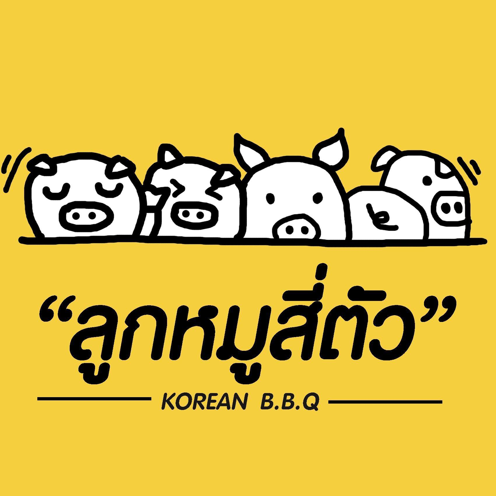

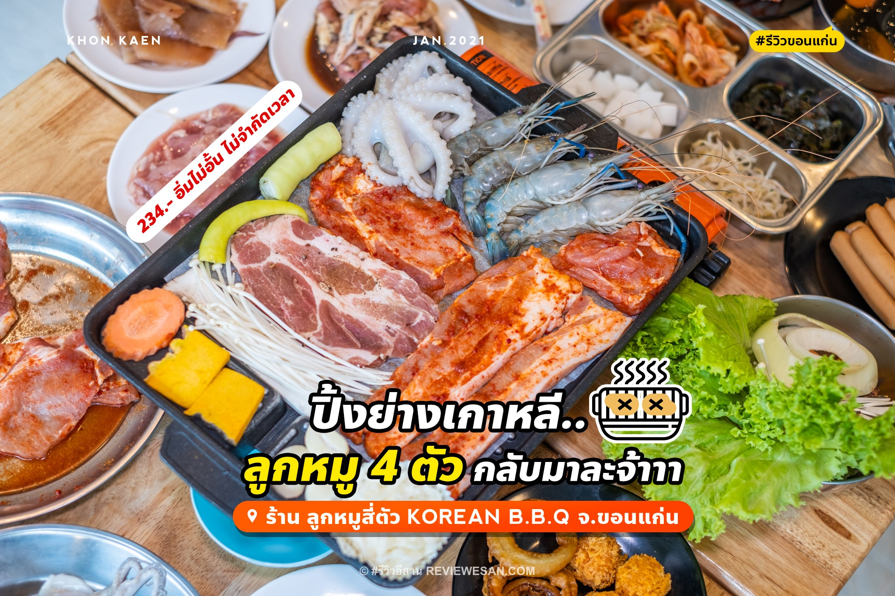

*อ้างอิงรูปภาพจาก :* [ลูกหมูสี่ตัว]( https://www.facebook.com/ลูกหมูสี่ตัว-Korean-BBQ-100370624772851)

ลูกหมูสี่ตัว ปิ้งย่างฟีลเกาหลี 
- ราคาเพียง 234.-  
- ไม่จำกัดเวลา
- มีอาหารเกาหลี กิมจิ ไชเท้าดอง ไก่ทอดซอสเกาหลี หอมทอด รวมถึงผักสด
- ซีฟู้ดมีหมึก กุ้ง 
- เนื้อจะเป็นสามชั้นและสันคอหมูหมักสูตรต่างๆ  
- ของหวาน จะเป็นขนมถ้วย และไอติมอีกหลายรสชาติให้เลือก อาทิเช่น รสมะนาว รสวนิลา และอื่นๆเป็นต้น 

- เปิด 12.00-22.00 ทุกวัน
- โทร : 095 391 3731
พิกัด : https://goo.gl/maps/7jY8voztdmzYMSGw5
กังสดาลติดร้าน grim cafe

### 2. ศุนย์อาหารและบริการ 2 มข. (โรงชาย)
> ถูกและดี มีอยู่จริง!! มีอาหารให้เลือกหลากหลาย ทั้งข้าวราดแกง อาหารตามสั่ง ก๋วยเตี๋่ยว ผลไม้ และขนมหวาน ตั้งแต่ราคาหลักสิบถึงหลักร้อย
พิกัด: เยื้องสนามกีฬากลาง มข.
> เวลาเปิด-ปิด: ตลอดเวลา

### 3. ศูนย์อาหารและบริการ 1 (คอมเพล็กซ์)

*อ้างอิงภาพจาก:* [ศุนย์บริหารจัดการทรัพย์สินมข.](https://forum.khonkaenlink.info/index.php)
 ประเภทที่ให้บริการ
- ร้านอาหารสวัสดิการ จำนวน 26 ร้าน
- ร้านอาหาร เครื่องดื่ม Cafe'
- สำนักงานธนาคารไทยพาณิชย์ ธนาคารกสิกรไทย ธนาคารกรุงไทย ธนาคารกรุงศรีอยุธย
- ร้านสะดวกซื้อ(7 - ELEVEN)
- ศูนย์หนังสือ จำนวน 2 ร้าน
- ร้านให้บริการเสริมความงาม ตัดผมหญิง/ชาย/สปา
- ร้านทั่วไป
    (เช่น : ร้านขายยา /กิ๊ปซ๊อป / ถ่ายเอกสาร / เครื่องเขียน / อปกรณ์ไอที และคอมพิวเตอร์ / การศึกษาต่อต่างประเทศ / โรงเรียนกวดวิชา และสอนพิเศษ/ ร้านจำหน่ายตั๋วการโดยสารเครื่องบิน / อุปกรณ์ไฟฟ้า / ไปรษณีย์ )
- บูธชั่วคราว
    (เสื้อผ้า / กิ๊ฟช้อป / บริการตัดเย็บ / ซ่อมนาฬิกา / เติมเงินและซิมโทรศัพท์มือถือ /เครื่องดื่มและขนมขบเคี้ยว)
- ตู้ ATM   (ไทยพาณิชย์, กรุงไทย , กสิกร , กรุงเทพ)

### 4.ร้านส้มตำแตงโมแซบเวอร์ หลังมอ
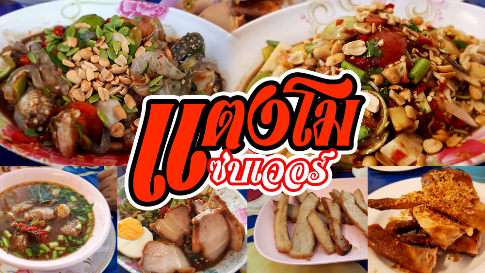

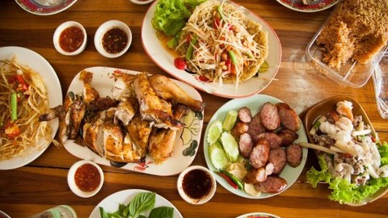
*อ้างอิงภาพจาก:* [khonkaenlink.info](https://forum.khonkaenlink.info/index.php?topic=17651823.0)

เป็นร้านส้มตำที่มีคนนิยมไปกิน มีเมนูให้เลือกมากมาย เช่น ส้มตำ ไก่ย่าง ลาบ อ่อม ต้มแซบต่างๆ รสชาติถูกปาก ราคาสบายกระเป๋า มีน้ำดื่ม ช้อน จาน บริการตัวเองให้ฟรี

### 5.ร้านปลาวาฬใจดี
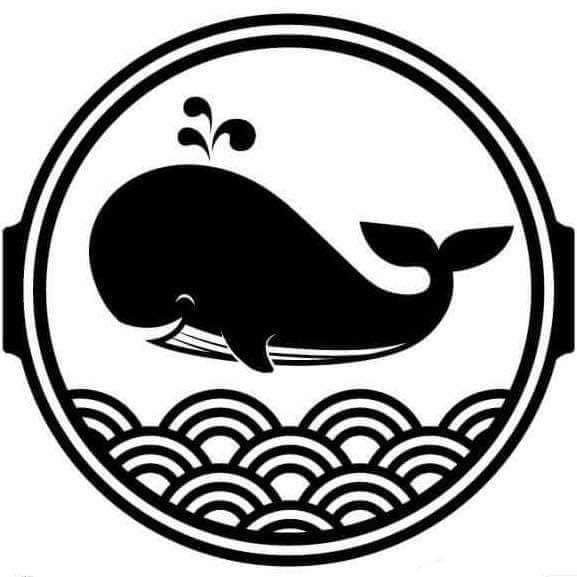

*อ้างอิงภาพจาก:* [WhaleJaiDee.KKU](https://www.facebook.com/WhaleJaiDee.KKU)

ประเภทที่ให้บริการ
- ร้านอาหารบุฟเฟ่ต์ ไม่จำกัดเวลา
- มีทั้งอาหารสดและอาหารทะเล

### 6.FattyFox

*อ้างอิงภาพจาก:* [fattyfox.official](https://www.facebook.com/fattyfox.official)

ประเภทที่ให้บริการ
- ร้านอาหารบุฟเฟ่ต์ จำกัดเวลา 2 ชั่วโมง
- เหมาะสำหรับคนรักเนื้อวัว
- บรรยากาศดี แอร์เย็น

### 7. ร้านสีนานวล คาเฟ่ 

*อ้างอิงข้อมูลและภาพจาก:* [See-na-nuan cafe](https://www.facebook.com/569003476607731/posts/1155601687947904/)

- สุดยอดร้านอาหารไทยโบราณขอนแก่น
- ราคาดี บริการดี บรรยากาศดี อาหารอร่อย
***พิกัด***
- สาขา 1 หลัง มข. หน้าประตูเขียว ข้างหลังหออินเตอร์ หลังปั๊ม ปตท. มข. 
เปิดทุกวัน 10.00-22.00 น. รองรับ 200 ที่นั่ง 
สำรองที่นั่งล่วงหน้าโทร 043-058872
- สาขา 2 กังสดาล มข.
หลังโอปอ บุฟเฟ่ต์ ตรงข้ามสเต็กรอยยิ้ม โรงแรมฌาร์ม บูทิค ข้างโรมแรมกัลปพฤกษ์ โฮมเทล
เปิดทุกวัน 10.00-00.00 น. รองรับ 500 ที่นั่ง 
สำรองที่นั่งล่วงหน้าโทร 043-001200

### 8. T-Bone Steak House
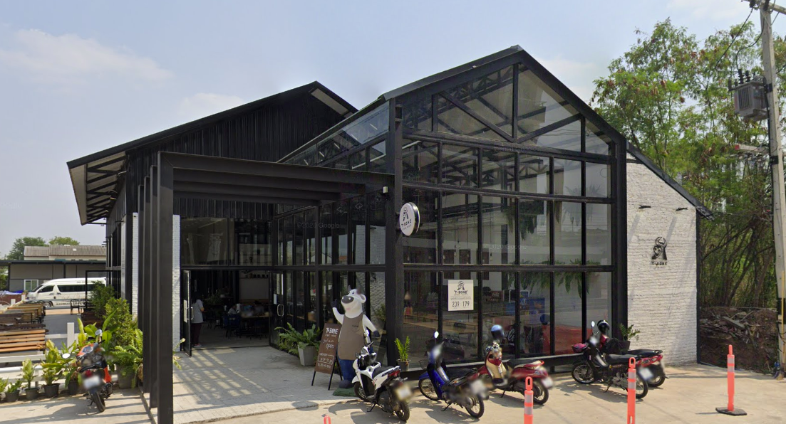

*อ้างอิงภาพจาก :* [Google Maps](https://www.google.co.th/maps/@16.4574373,102.8233743,3a,60.7y,153.17h,91t/data=!3m6!1e1!3m4!1sr3owH4sHzQCtBgcptMD64Q!2e0!7i16384!8i8192)

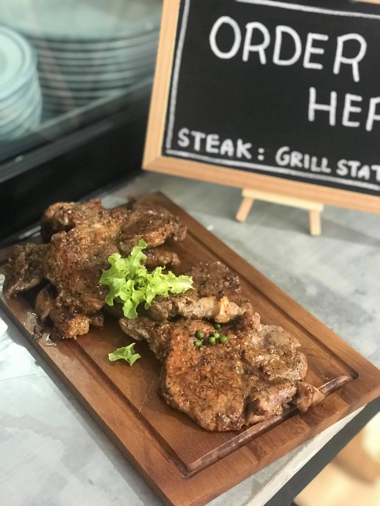

*อ้างอิงภาพจาก :* [Facebook page : T-Bone Steak House.](https://www.facebook.com/tbonekk/)

- ร้านบุฟเฟ่เสต็ก อิ่มอร่อยสุดคุ้ม กินไม่อั้น ! !
- ราคา 239 บาท รีฟิลน้ำ
- มีสเต็กหมู ไก่ วัว ทีโบน ปลา
- อาหารว่างมากมาย
เวลาเปิดให้บริการ : 16:00 ~ 22:00

### 9. ร้านอาหารครัวปืนใหญ่
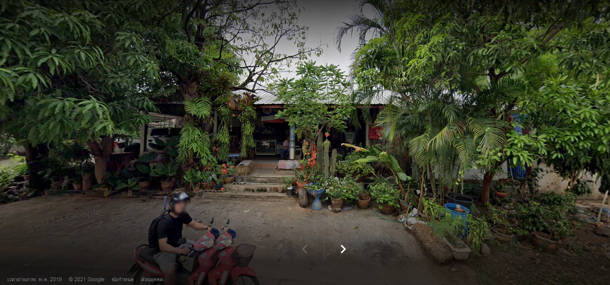

*อ้างอิงภาพจาก :* [Google Maps](https://www.google.com/maps/uv?pb=!1s0x3122615fa7113277%3A0x71b18ac30e90a9f4!3m1!7e115!4zL21hcHMvcGxhY2UvJUUwJUI4JTg0JUUwJUI4JUEzJUUwJUI4JUIxJUUwJUI4JUE3JUUwJUI4JTlCJUUwJUI4JUI3JUUwJUI4JTk5JUUwJUI5JTgzJUUwJUI4JUFCJUUwJUI4JThEJUUwJUI5JTg4KyVFMCVCOCU4MiVFMCVCOCVBRCVFMCVCOCU5OSVFMCVCOSU4MSVFMCVCOCU4MSVFMCVCOCU4MSVFMCVCOSU4OCVFMCVCOCU5OS9AMTYuNDc5OTA5NSwxMDIuODAwNjU0NSwzYSw3NXksMC41OWgsOTB0L2RhdGE9ITNtNCExZTEhM20yITFzZENtamRTbFBKT19NQVJQWGp5bktiUSEyZTAhNG0yITNtMSExczB4MzEyMjYxNWZhNzExMzI3NzoweDcxYjE4YWMzMGU5MGE5ZjQ_c2E9WA!5z4LiE4Lij4Lix4Lin4Lib4Li34LiZ4LmD4Lir4LiN4LmIIOC4guC4reC4meC5geC4geC4geC5iOC4mSAtIOC4hOC5ieC4meC4q-C4suC4lOC5ieC4p-C4oiBHb29nbGU!15sCgIgAQ&imagekey=!1e2!2sdCmjdSlPJO_MARPXjynKbQ&hl=th&sa=X&ved=2ahUKEwjn7NCb5o_uAhUFzDgGHanrDIIQpx8wDHoECBYQAw)

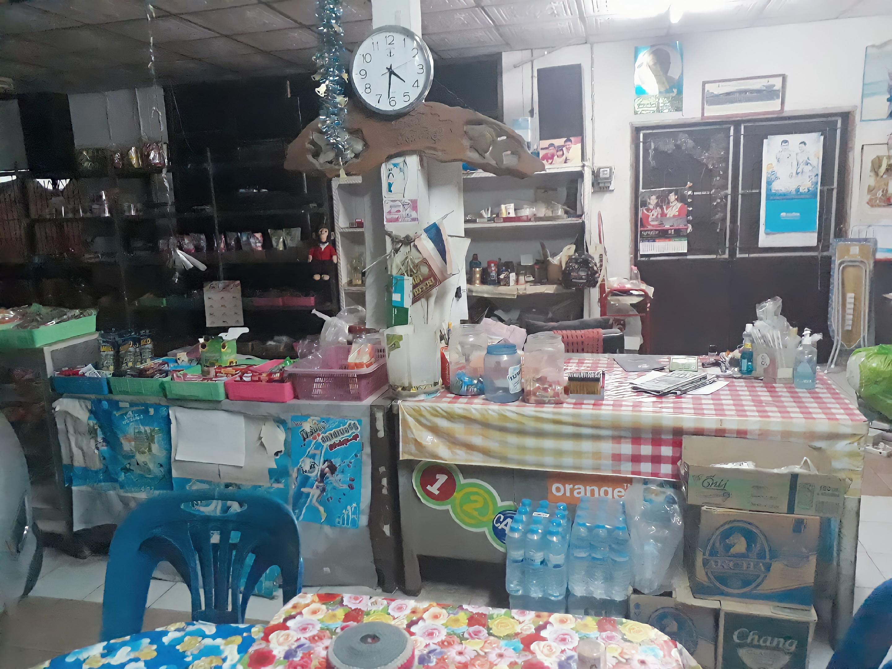

- ร้านขายของชำทั้งน้ำ ขนม เครื่องปรุงรส หรือของใช้ต่างๆ
- อีกทั้งยังเป็นร้านอาหารที่รับประกันความอร่อยและคุ้มราคา
- อาหารเริ่มต้นที่ 25 บาท
- แม่ค้าเป็นกันเอง

สถานที่ : ใกล้ประตูหลังค่ายร.8 ติดวัดอดุลแก้วมอดี

เวลาเปิดให้บริการ : 08:00 - 20:00 น.

### 10. Haru Hana : Japanese Cafe
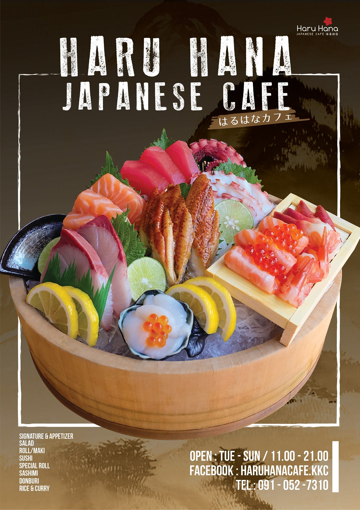

*อ้างอิงภาพจาก :* [Facebook page : Haru Hana : Japanese Cafe](https://www.facebook.com/haruhanacafe.kkc/)

- ร้านอาหารญี่ปุ่นในแบบ Modern Japanese Sushi Cafe
- นำเสนออาหารญี่ปุ่นสไตล์นิวยอร์คสุดชิค ที่เน้นเครื่องปรุง และพิถีพิถันในการทำ จนได้รสชาติที่เป็นเอกลักษณ์ในสไตล์
- มีของหวานสไตล์ญี่ปุ่นอีกหลายเมนู
- เหมาะสำหรับคนที่ชื่นชอบอาหารญสไตล์ี่ปุ่น 

เวลาเปิดร้าน : อังคาร - อาทิตย์	10:00 - 20:00

การเดินทาง : 45/95 ซอย อดุลยาราม ขอนแก่น (จากในเมืองเส้นถนนมิตรภาพทางไปอุดร เจอปั๊มเอสโซ่ ให้ขับมาเรื่อยๆ จะเจอร้านมิตรภาพลาบก้อย ขับเลยไปจะเจอซอย ให้เลี้ยวซ้ายประมาณ 100 เมตร ฝั่งกังสดาล มข)

เบอร์โทร : 091 052 7310

### 11 . โบโบ้เครป&นมสด หลังมอ
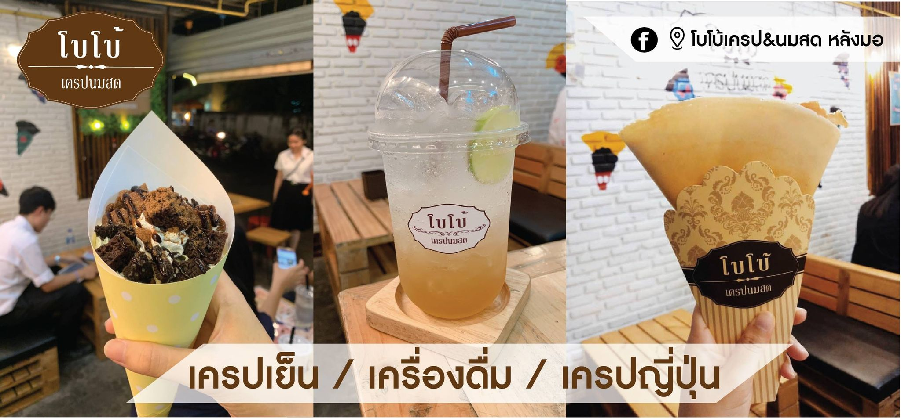
*อ้างอิงข้อมูลและภาพจาก:* [FB โบโบ้เครป&นมสด หลังมอ ](https://www.facebook.com/720579054656527/posts/2177554775625607/)
> เป็นร้านเครปยอดฮิตของชาว มข. ซึ่งมีเมนูที่หลายหลยากให้เลือกสรร จุดเด่นอยู่ที่แป้งทีนำมาใช้ทำ
> พิกัด : หลังมอ เทศบาลนครขอนแก่น 40000 (หลัง มข. ออกประตู U Center เลี้ยวซ้าย จะเยื้องกับอเมซอน) 
> เวลาเปิด - ปิด 18.00 - 00.00 น.

### 12. On-Zon
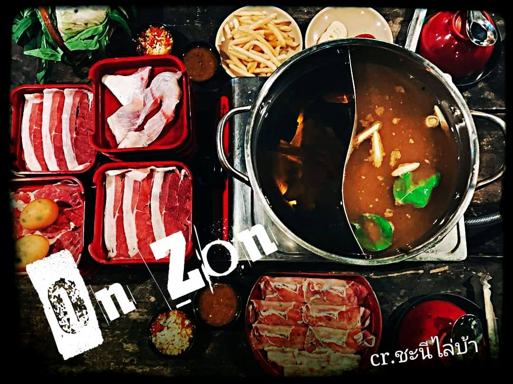

*อ้างอิงภาพจาก :* [Facebook page : On-Zon ออนซอน แจ่วฮ้อน&ชาบู - ขอนแก่น](https://www.facebook.com/onzonbuffet/)

- ร้านแจ่วฮ้อน&ชาบู บุฟเฟ่ต์ ย้านโนนม่วง
- มีเนื้อหมูสไลด์ ในเลือกหลากหลายแบบ
- มีของว่างและของหวานให้รับประทาน
- ราคานักศึกษา เริ่มต้นที่ 149 บาท (ไม่รวมเครื่องดื่ม)
เวลาเปิด	: 16.00 - 22.30

พิกัด		: 161 บ้านโนนม่วง หมู่ที่ 3 ต.ศิลา อ.เมืองขอนแก่น จ.ขอนแก่น 40000

ติดต่อ		: 085 853 2006 หรือที่ Facebook page : On-Zon ออนซอน แจ่วฮ้อน&ชาบู - ขอนแก่น

### 13. ร้านแล้วแต่ กะเพราแท้ ขอนแก่น

*อ้างอิงภาพจาก:* [wongnai.com](https://www.wongnai.com/news/laew-tae-kapraow-restaurant-kku)

ประเภทที่ให้บริการ
- ร้านอาหารกะเพรา

เวลาให้บริการ
- เวลาทำการ : จันทร์-ศุกร์ 11:00 - 15:00 17:00-21:00 น. 
เสาร์ - อาทิตย์ 11:30 - 15:00 17:00 - 21:00 น
- ทุกวันจะพักเบรค : 15:00-17:00 น.

### 14. นายฮ้อยย่างมันส์
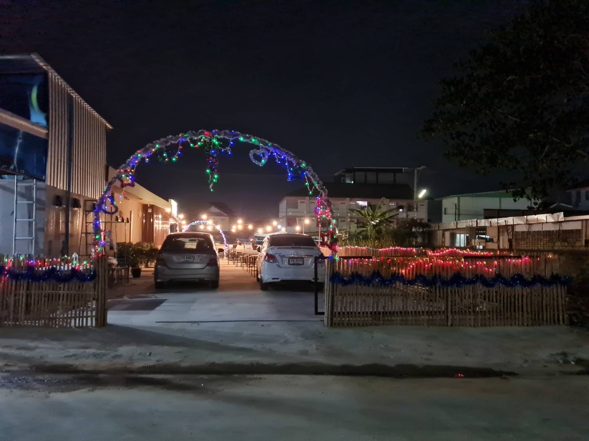
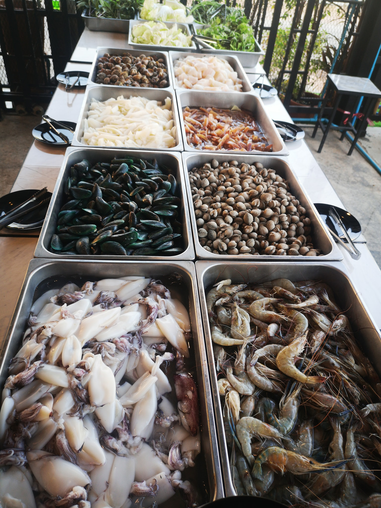
*อ้างอิงรูปภาพจาก :* [นายฮ้อย ย่างมันส์](https://www.facebook.com/นายฮ้อย-ย่างมันส์-102844691558941)

นายฮ้อย ย่างมันส์
- ราคาเริ่มต้น 199.-
- หมู ไก่ กุ้ง แซลม่อน ปูม้า โคขุนเกรดเอ
- ยำปูม้า หอย 
- น้ำดื่มรีฟิว8รสชาติ

เปิด 16.00-22.00 ทุกวัน
โทร : 095 728 8278
พิกัด : https://goo.gl/maps/W5NpEfnF5G4ViH2n7

### 15. ตุงตุงเฮ 뚱뚱해
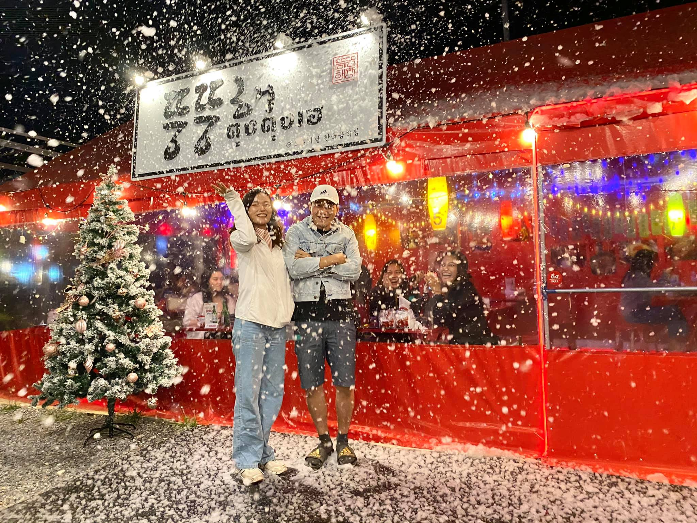
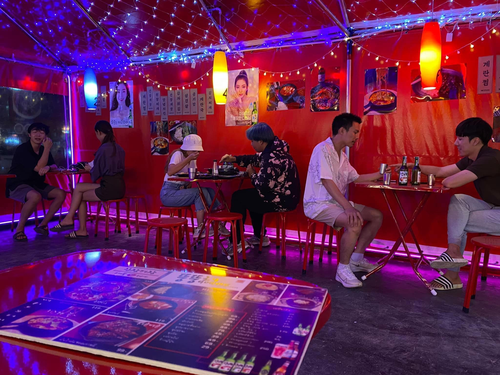
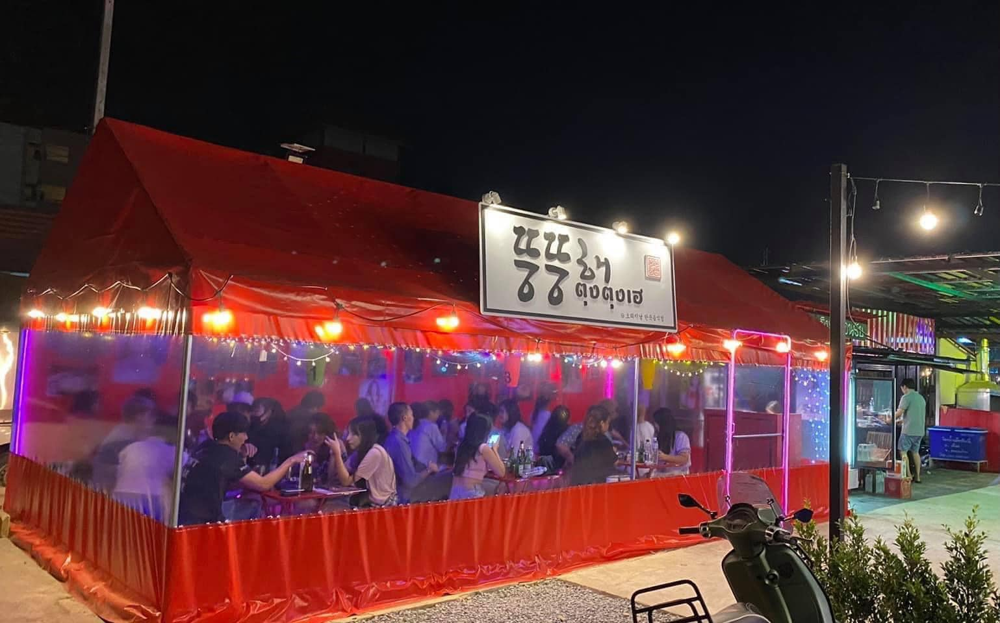

*อ้างอิงข้อมูลและภาพจาก:* [tungtunghaekku](https://www.facebook.com/tungtunghaekku/)

>อาหารสตรีทเกาหลี ปูไข่ดองซีอิ้วเกาหลี เต้นท์ติดแอร์ เปิด 17:00-24:00 (ครัวปิด 23:00 นั่งดื่มต่อได้ค่ะ) ร้านหยุดทุกวันพุธ
พิกัด : กังสดาล มข ขอนแก่น (เต้นท์สีแดง ตรงข้ามสเต็กรอยยิ้ม)

### 16. Good แหนมเนือง (กู๊ดแหนมเนือง)
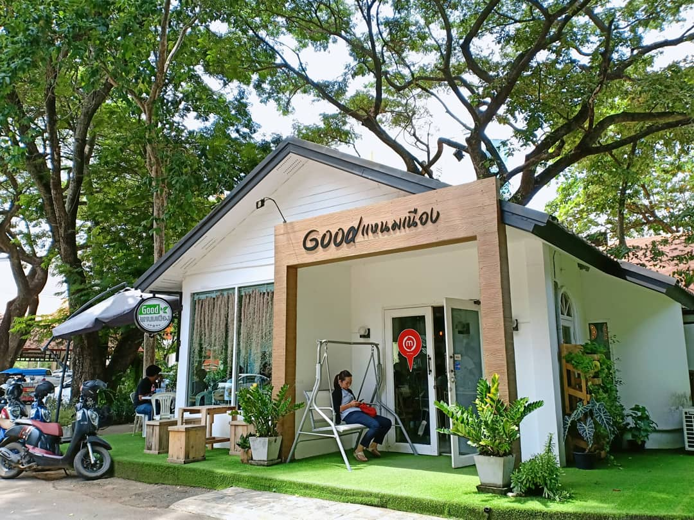
*รูปภาพจากคุณ* [The Popino](https://www.google.com/url?sa=i&url=https%3A%2F%2Ftwitter.com%2Fppraephotograp1%2Fstatus%2F1055809350319534081&psig=AOvVaw0y67kpxblFyFkw6HEETTs8&ust=1610364336014000&source=images&cd=vfe&ved=0CAIQjRxqFwoTCLiK5-Sgke4CFQAAAAAdAAAAABAD)

> มหาวิทยาลัยขอนแก่น ขอนแก่น (ข้างตึกอธิการ มหาวิทยาลัยขอนแก่น) 
จันทร์ - อังคาร 11:00 - 20:30
พฤหัสบดี - อาทิตย์ 11:00 - 20:30 

- ที่จอดรถ(มีที่จอดรถ)
- เดลิเวอรี่
- เหมาะสำหรับเด็กๆ
- เหมาะสำหรับมาเป็นกลุ่ม 

*ข้อมูลจาก* [Wongnai](https://www.wongnai.com/restaurants/278625vP-good-%E0%B9%81%E0%B8%AB%E0%B8%99%E0%B8%A1%E0%B9%80%E0%B8%99%E0%B8%B7%E0%B8%AD%E0%B8%87)

### 17. ย่างเพราเห่าดง
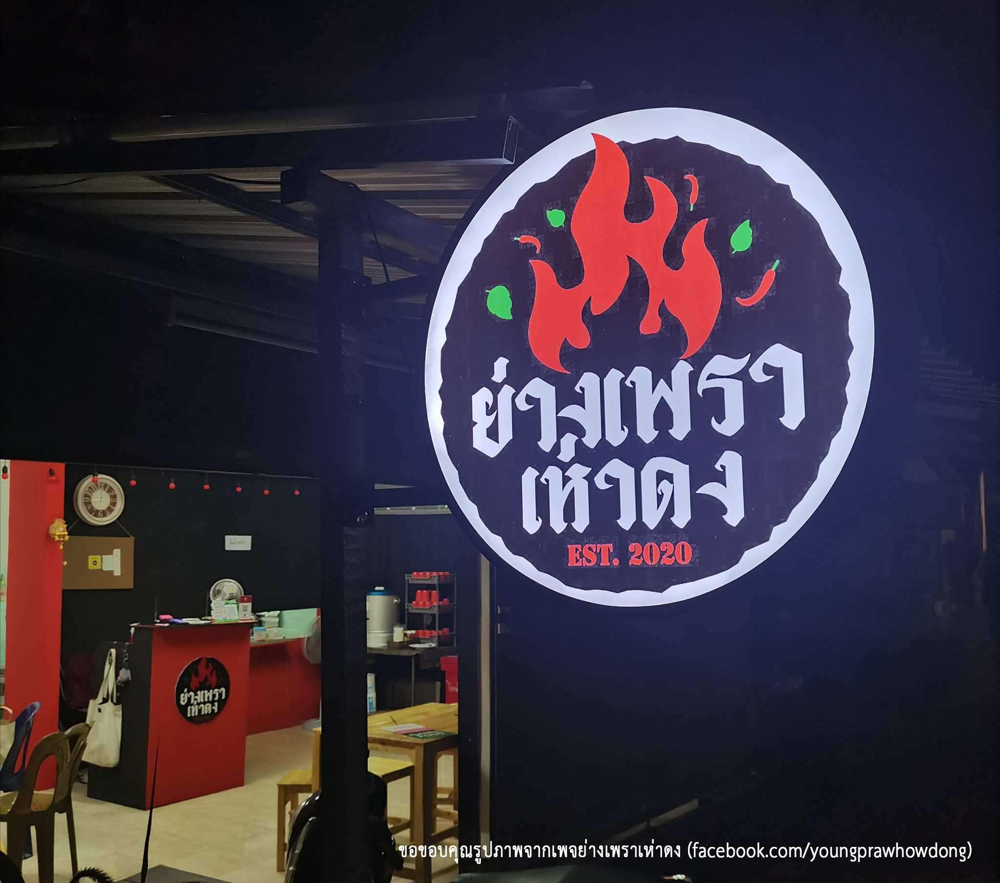
*อ้างอิงรูปภาพจาก :* [ย่างเพราเห่าดง](https://www.facebook.com/youngprawhowdong)

ที่อยู่ : 363 หมู่ 27 ซ.เกษียรสินธุ์ ต.ศิลา อ.เมือง เทศบาลนครขอนแก่น 40000
พิกัด : ขับเลย 7-11 สาขายูเซ็นเตอร์ ขอนแก่น เลี้ยวขวาเข้าซอยไปนิดเดียว ร้านจะอยู่ทางขวามือ
สถานที่ใกล้เคียง : TOP เครื่องเขียน มข. และ ยูเซ็นเตอร์
วันเวลาเปิดร้าน : จันทร์-อาทิตย์ เวลา 11.00 -21.00 น. หยุดทุกวันพุธ
เบอร์ติดต่อ : 097 974 4422
อีเมล : youngprawhowdong@gmail.com

ย่างเพราเห่าดง คืออะไร?
คำตอบ คอหมูย่าง กะเพราหมู และเห่าดงหมู

เมนูประจำร้านมีอะไรบ้าง ?
คำตอบ ข้าวกะเพราหมูสับ/ชิ้น ราคา 45 บาท
ข้าวกะเพราคอหมูย่าง ราคา 55 บาท
ข้าวคอหมูย่าง ราคา 50 บาท
ข้าวเห่าดงหมู (หมูลวกคลุกน้ำปลา มะนาว พริกป่น และใส่ใบกะเพรา) ราคา 50 บาท
ข้าวเห่าดงคอหมูย่าง ราคา 55 บาท
+ พิเศษเพิ่ม 10 บาท
+ ไข่เจียว/ไข่ดาว ราคา 10 บาท
+ ไข่ข้น ราคา 15 บาท
+ เพิ่มกับ ราคา 20 บาท และเป็นกับ 60 บาท (บางเมนู +5 บาท)

Food Delivery ?
คำตอบ สามารถค้นหาชื่อร้านด้วย FoodPanda และ GrabFood 
(ราคาอาจเปลี่ยนแปลงจากหน้าร้าน)

ติดตามข่าวสารได้จากที่ไหน ?
คำตอบ เพจเฟซบุ๊กของร้าน "ย่างเพราเห่าดง" หรือ อินสตราแกรม @youngprawhowdong

### 18. Pietro Garden - เพโทร การ์เด้น
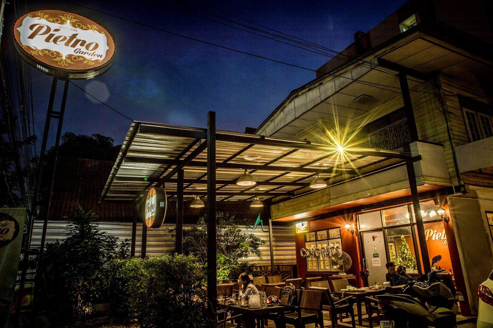
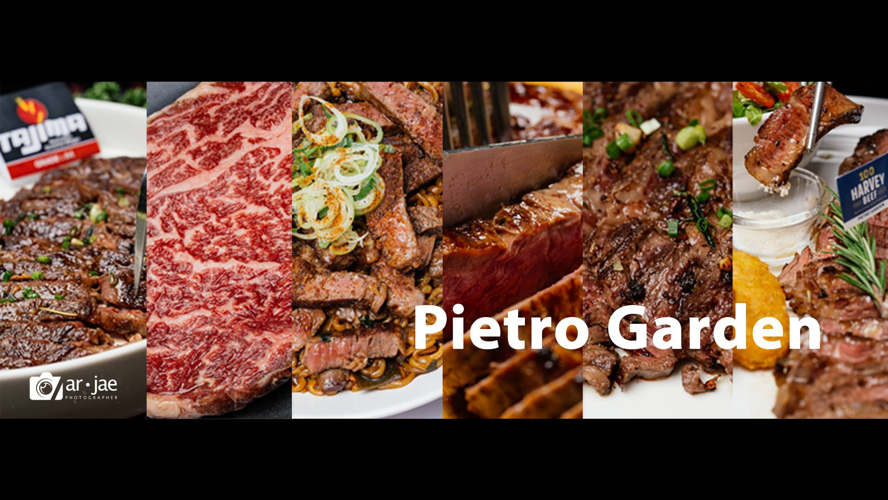

*อ้างอิงรูปภาพจาก :* [Pietro Garden - เพโทร การ์เด้น](https://www.facebook.com/Pietrogarden/photos/a.400525293386095/2561514003953869)
- อาหารรสชาติอร่อย
- คุ้มราคา
- บรรยากาศดี
>พิกัดร้าน google map : <https://goo.gl/maps/xCTns3RL2AnsGSeK8> facebook : [Pietro Garden - เพโทร การ์เด้น](https://www.facebook.com/Pietrogarden) 
>ร้านเปิดทุกวัน เวลา 13.00-22.00 เบอร์ติดต่อ : 089 692 0013

## 19. สามอ้วนชวนกิน ก๋วยจั๊บอุบล
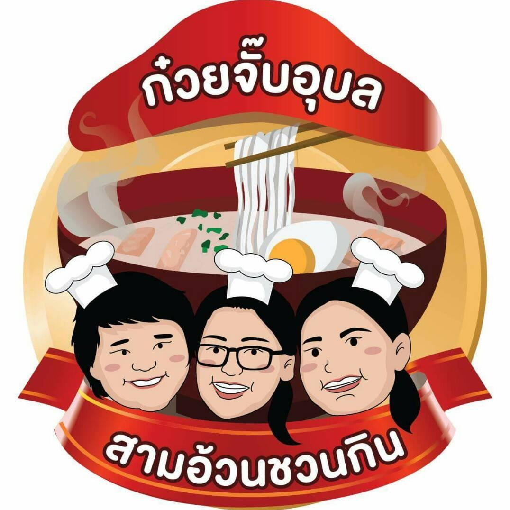
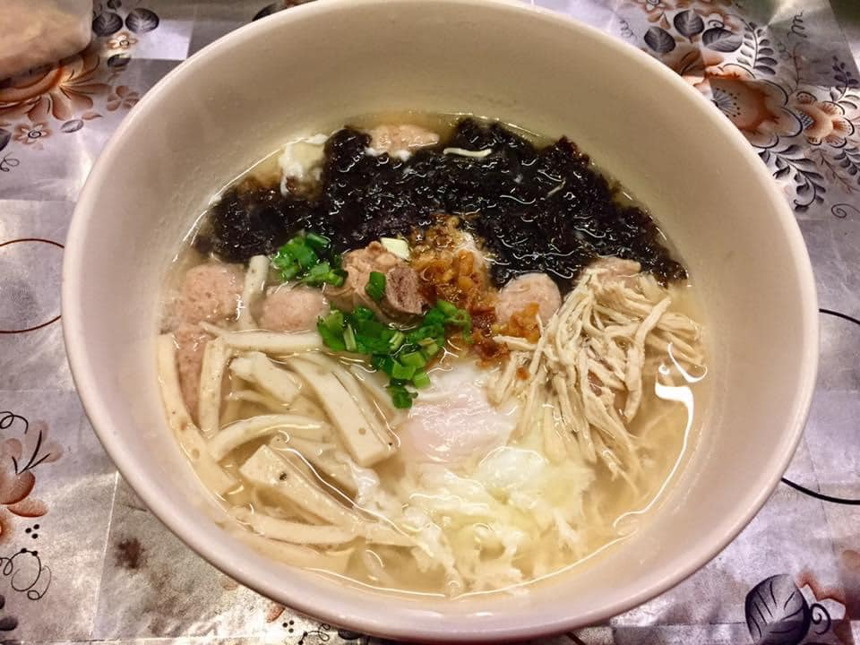
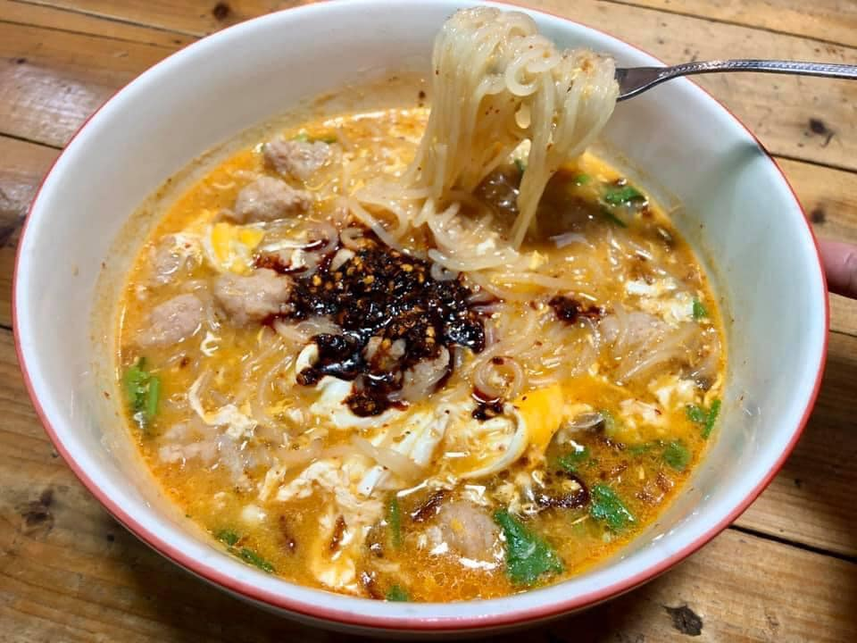
*อ้างอิงรูปภาพจาก :*(https://www.facebook.com/samuanubolnoodlesoup/?ref=page_internal)

ก๋วยจั๊บอุบล มาม่า วุ้นเส้น ข้าวต้มเครื่อง เท้าพระลอ ปีกไก่ทอด เกี๊ยวทอด น้ำกระเจี๊ยบ
มีพร้อมขายแล้วน๊า จั๊บแบบต้มทานเองที่บ้าน
มีน้ำซุป 3 แบบ
-สูตรดั้งเดิม 🍜
-สูตรต้มยำน้ำข้น 🌶
- สูตรแกงเขียวหวาน 🥬🧄
พิกัด : 3 ซอย อิงมอ ตำบล ศิลา อำเภอเมืองขอนแก่น ขอนแก่น 40000
วันเวลาเปิดร้าน : เวลา 11.00 -20.00 น. หยุดทุกวันศุกร์
เบอร์ติดต่อ : 086 221 0930

## Cafe :coffee: :cake: :tea:
Here are the best places where you can enjoy your a cup of coffee and delicious desserts.
#### 1. Coffee Der Lar คอฟฟี่เด้อหล่า - มหาวิทยาลัยขอนแก่น

*อ้างอิงข้อมูลและภาพจาก:* [Coffee Der Lar Fanpage](https://www.facebook.com/coffeederlakk)

> ร้านกาแฟในมหาวิทยาลัยขอนแก่น ที่พิถีพิถันในเรื่องของการคัดเลือกเมล็ดกาแฟ อีกทั้งยังมีHomemade Bakery และเครื่องดื่มอื่นๆอีกมากมาย ตอบโจทย์ Lifestyle แบบคนเมือง ในราคาที่คุณดื่มได้ทุกวัน
> ให้บริการ 8.00น. - 20.00น. โทร. 095-6466161
#### 2. Kojimori Matcha
> KOJIMORI MATCHA คนชอบชาเขียวต้องไม่พลาด ที่นี่ชาเขียวดี
> วันนี้จะพาไปกินชาเขียวรสชาติเข้มข้น หอม หวาน มัน กับร้านที่ชื่อ KOJIMORI MATCHA ร้านชาเขียวเล็กๆ ที่บรรยากาศอบอุ่น ตกแต่งร้านได้อารมณ์เหมือนอยู่ญี่ปุ่นเลย ที่นี่ใช้ชาเขียวเกรดดี พรีเมียม ทำให้สัมผัสได้ถึงรสชาติชาเขียวที่แท้จริง บวกกับคนปรุงเข้าใจวัตถุดิบของตัวเองเป็นอย่างดี จึงทำให้ชาเขียวของที่ร้านถูกปากคนกินอย่างผม และใครที่ไม่ชอบหวานก็สามารถลดความหวาน หรือเลือกความหวานได้ตามใจด้วยเช่นกันครับ อ้อ มีไข่มุกด้วย
*> **อ้างอิงจาก [khonkaenlink.info](https://forum.khonkaenlink.info/index.php?topic=17746360.0)***
> 

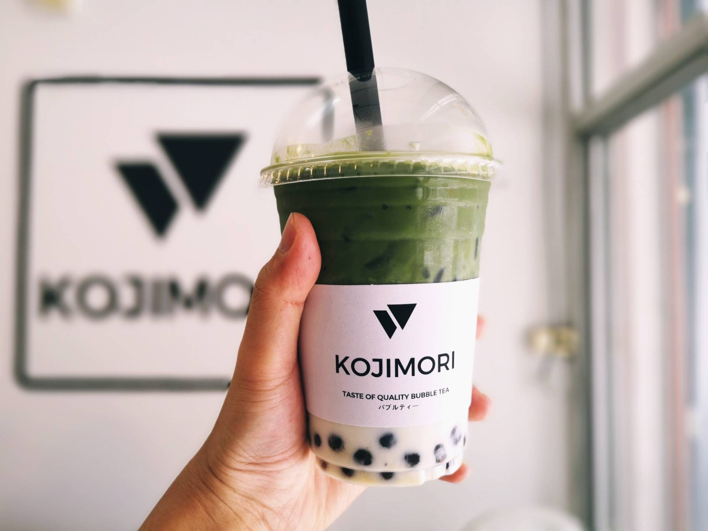
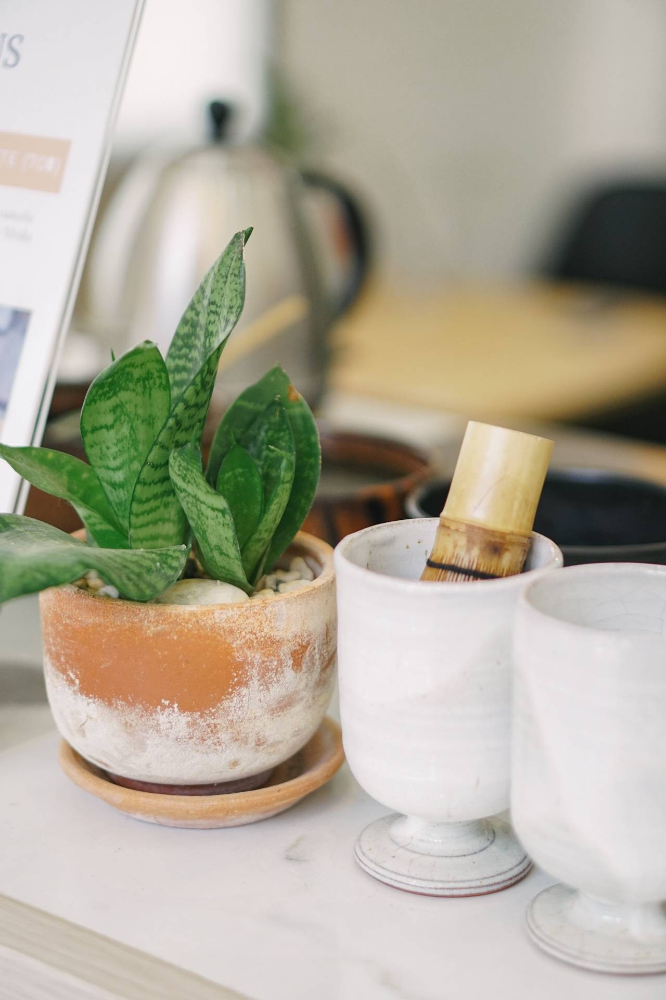

*อ้างอิงข้อมูลและภาพจาก:*[Wongnai.com](https://www.wongnai.com/restaurants/339452gD-kojimori)

3.มหาเจียว
> สำหรับร้านนี้สาวกไข่เจียวบอกเลยว่าห้ามพลาด เจียวๆๆ ไข่เจียว ไข่ดาว เจียวลาบ เจียวแหนม เจียวทะเล เจียวรวม เจียวดาว เจียวต้มยำ โอ้ยยยสารพัดจะเจียวจะดาว สมกับชื่อมหาเจียวจริงๆ ส่วนน้ำจิ้มก็ไม่น้อยหน้า น้ำจิ้มแจ่ว ซีฟู้ด กะปิ หมาล่า เผ็ด หวาน เปรี้ยว ครบรส ใส่ได้ไม่อั้นเลือกสรรได้ตามใจชอบเลยจ้า ที่สำคัญราคานักศึกษา เริ่มต้นที่ 20 บาท!! โอ้โหคุ้มสุดๆ
>  ที่อยู่      :  หลังมหาวิทยาลัยขอนแก่น  ต. ในเมือง อ. เมือง จ. ขอนแก่น (หลังหอพักชายที่ 27)                                                  เปิด-ปิด  : 15.00-24.00                                                                                                                                                     โทร       :  089-1039181

**KOJIMORI MATCHA** 
เปิดให้บริการ : 10.30 - 21.00 น. 
โทรศัพท์ : 085 349 9612 
พิกัด : ถนนอดุลยาราม ใกล้ร้านตัดผม "เสย" พิกัด 
Google Map : https://goo.gl/maps/Szbk2paCynN8QeU68 Facebook Fan Page : [Kojimori Matcha](https://www.facebook.com/Kojimori-Matcha-463448217441872/) 
การชำระเงิน : รับเงินสด , QR-Payment

####  3. Little Osaka

> Little Oska เป็นร้านอาหารญี่ปุ่นเกรดพรีเมี่ยม ด้วยวัตถุดิบอย่างดีส่งตรงมาจากญี่ปุ่นเลยทีเดียว 
- 122/9 ถนน อดุลยาราม 2 ขอนแก่น (บึงหนองแวง ฝั่งกังสดาล) 
- เบอร์ติดต่อ 083-678-9018
**อ้างอิงข้อมูลและภาพจาก:*[Little Osaka](http://www.indy-trip.com/aroundkku/)***

####  4. ชมนม คาเฟ่ Chomnom Cafe' & ระเบียงดาว Craft Studio

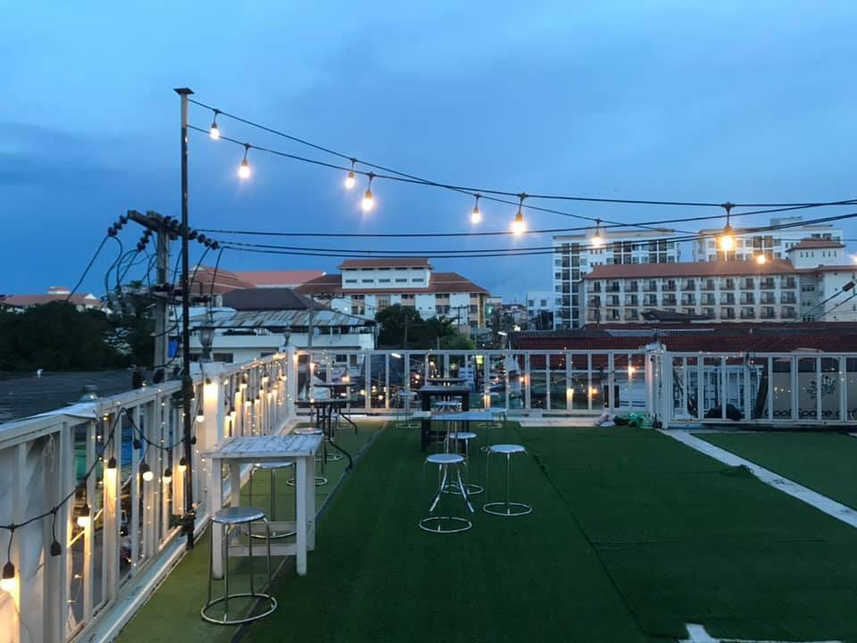
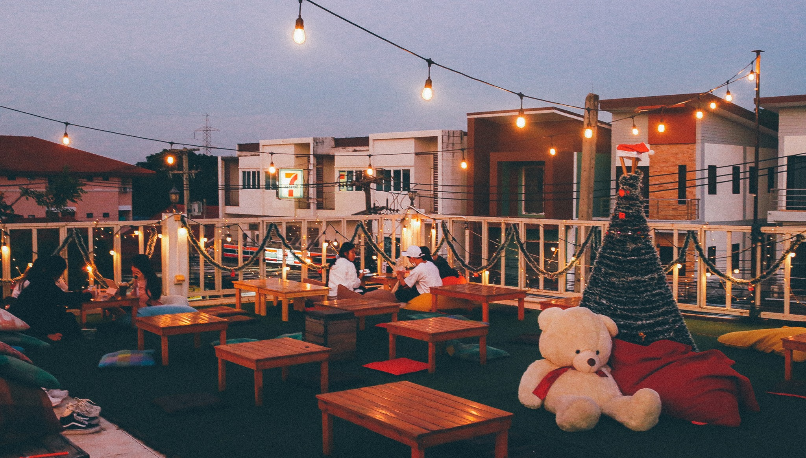

*อ้างอิงข้อมูลและภาพจาก:* [facebook : ชมนม คาเฟ่ Chomnom Cafe' & ระเบียงดาว Craft Studio](https://www.facebook.com/%E0%B8%8A%E0%B8%A1%E0%B8%99%E0%B8%A1-%E0%B8%84%E0%B8%B2%E0%B9%80%E0%B8%9F%E0%B9%88-Chomnom-Cafe-%E0%B8%A3%E0%B8%B0%E0%B9%80%E0%B8%9A%E0%B8%B5%E0%B8%A2%E0%B8%87%E0%B8%94%E0%B8%B2%E0%B8%A7-Craft-Studio-109820540361406/?ref=page_internal)

> ร้านชมนม เป็นคาเฟ่ที่มีกาแฟ บิงซู และฮันนี้โทส แบ่งเป็น 2 โซน โซนแรกเป็นโซนนั่งในร้าน เป็นห้องแอร์ โซนที่สองเป้นโซนให้นั่งบนดาดฟ้า เป็นที่เปิดโล่ง สามารถให้ลูกค้านั่งดื่มกาแฟพร้อมกับดื่มด่ำไปกับบรรยากาศท้องฟ้ายามค่ำคืนกับดวงดาวที่สวยงาม
- เวลาเปิดร้าน ทุกวัน  10:00 - 23:59 น.
- ช่วงราคาตั้งแต่ 49 บาท เป็นต้นไป
- พิกัด อยู่ในหมู่บ้านโนนม่วง ติดกับหอพัก The Future โนนม่วง

#### 5. Samannachan Café (สมานฉันท์ คาเฟ่)
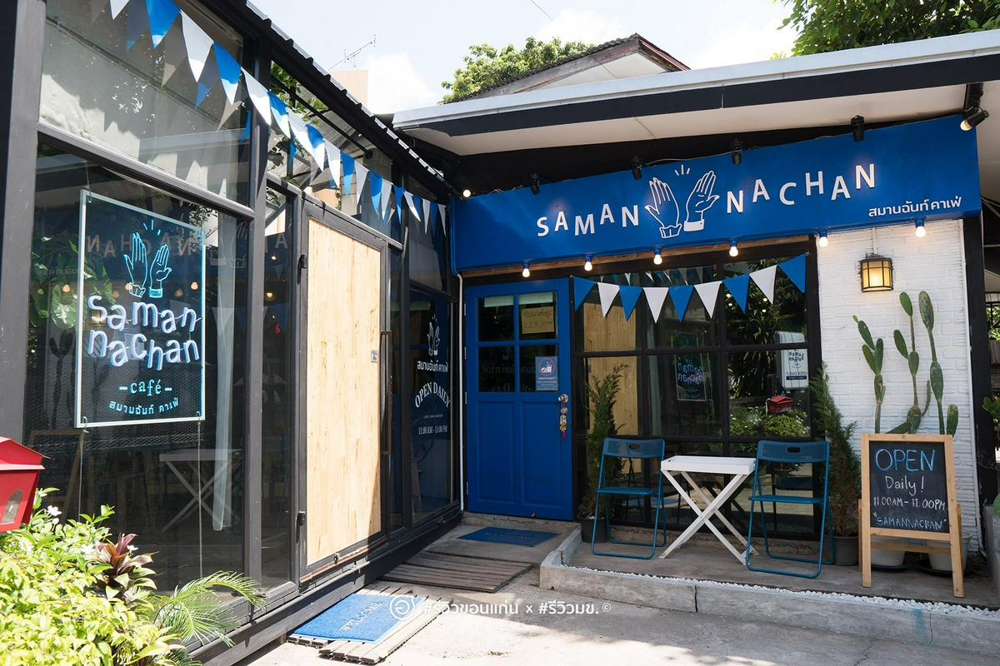
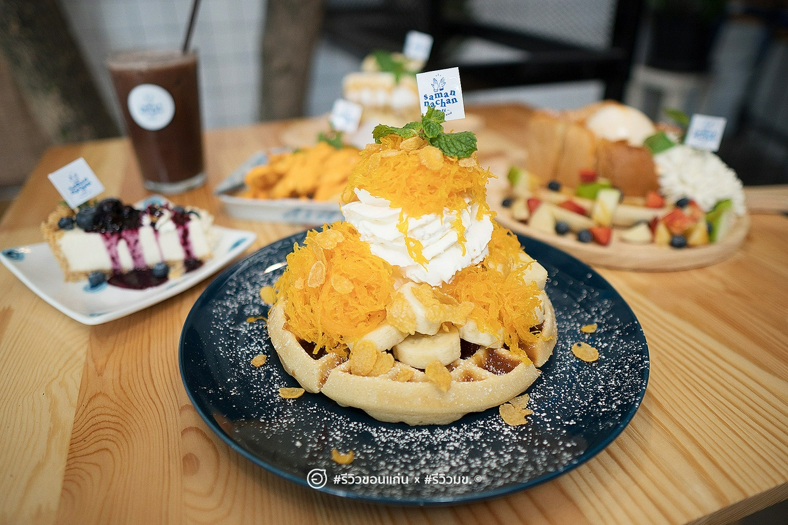

*อ้างอิงข้อมูลและภาพจาก:* [ขอนแก่น swapgap](https://www.swapgap.com/post/%E0%B8%A3%E0%B8%B5%E0%B8%A7%E0%B8%B4%E0%B8%A7%E0%B8%A3%E0%B9%89%E0%B8%B2%E0%B8%99-samannachan-cafe-%E0%B8%AA%E0%B8%A1%E0%B8%B2%E0%B8%99%E0%B8%89%E0%B8%B1%E0%B8%99%E0%B8%97%E0%B9%8C-%E0%B8%84%E0%B8%B2%E0%B9%80%E0%B8%9F%E0%B9%88-mun5uf)

> สมานฉันท์ คาเฟ่ เป็นร้านคาเฟ่ที่มีเมนูทั้งเครื่องดื่มและเบเกอรี่โดยภายในร้านจะตกแต่งให้มีบรรยากาศเป็นกันเอง นอกจากนี้ยังมีมุมถ่ายรูปสวยๆภายในร้านค่อนข้างเยอะ
- พิกัด : หลังม.ขอนแก่น (Sribrown เก่า ตรงข้ามส้มตำรสไทย)
- เปิด : 11:00น.-23:00น.
- Facebook : Samannachan Café - สมานฉันท์ คาเฟ่

#### 6. Chaban Café (ชบาน์ คาเฟ่)
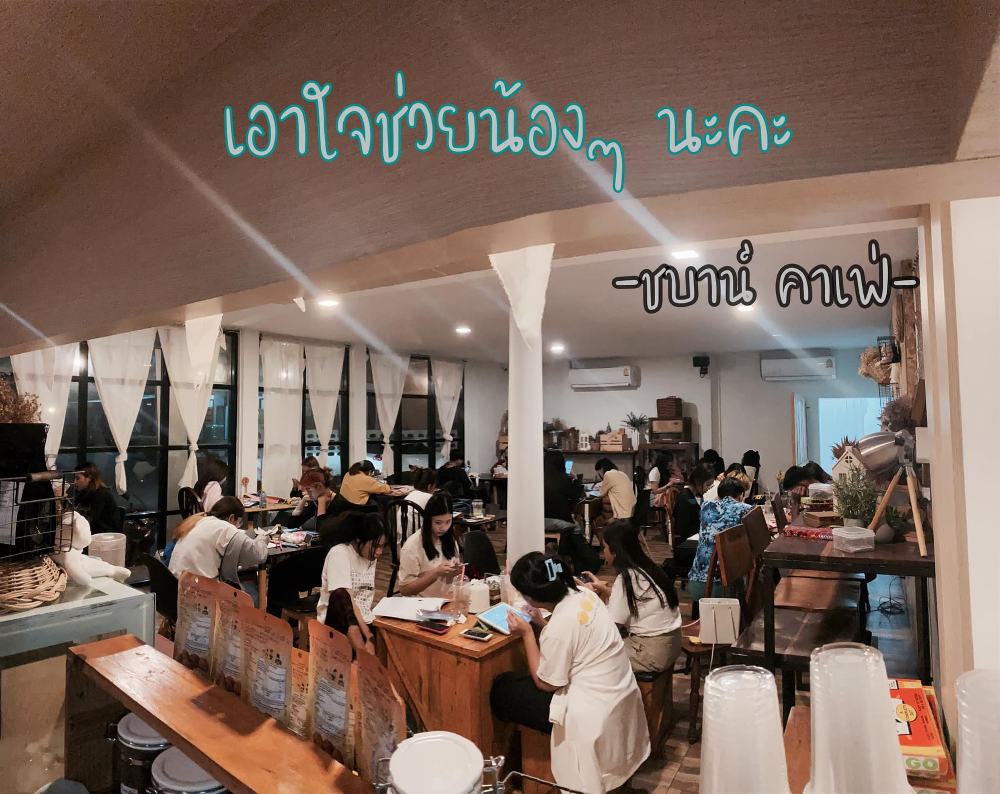

*อ้างอิงภาพจาก:* [facebook ชบาน์](https://www.facebook.com/Chaban.KKU/)

>ชบาน์คาเฟ่ เป็นร้านที่มีเมนูทั่งอาหารคาวและอาหารหวาน โดยเป็นสถานที่นักศึกษาจะชอบมาอ่านหนังสือหรือติวหนังสือกันกัน และอาหารแต่ละอย่างก็มีราคาที่ถูกอีกด้วย
- พิกัด : หลังม.ขอนแก่น
- เปิด 11.00 - 03.00น.
- Facebook : ชบาน์ ร้านกาแฟใกล้มหาลัยขอนแก่น ร้านกาแฟหลัง มข โนนม่วง

#### 7. 11AM cafe and space (11AM คาเฟ่ขอนแก่น)

*อ้างอิงภาพจาก:* [ทรูไอดี ฟู้ด](https://food.trueid.net/detail/j7y0P0Dxw6o3)

>11AM cafe and space เป็นร้านคาเฟ่สไตล์มินิมอลที่สรรสร้างขึ้นด้วยแรงกาย แรงใจของยูทูปเบอร์สาว Mayyr(เมอา) ที่มีทั้งเครื่องดื่ม ของหวาน รวมไปถึงเสื้อผ้า กระเป๋ามีสไตล์พี่เม บอกได้เลยว่าถ้าไม่มา เหมือนมาไม่ถึงขอนแก่นกันเลยจ้า
- พิกัด : เยื้องสนามเทนนิสศรีชาพันธ์ เทศบาลนครขอนแก่น อำเภอเมือง ขอนแก่น
- เปิด  11.00 - 19.00 น.
- Facebook : [11AMcafeandspace](https://www.facebook.com/11AMcafeandspace)

#### 8. Sri Brown Cafe' ศูนย์อาหารคอมเพล็กซ์ มข
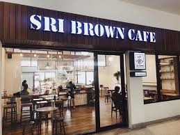

*อ้างอิงภาพจาก :* [facebook Sri Brown Cafe'](https://www.facebook.com/sribrowncafeComplex/)

>Sri Brown Cafe'คาเฟ่แห่งนี้เป็นอีกหนึ่งที่ๆเด็ก มข. ชอบมา ที่ sir brown มีเครื่องดื่มและของว่างแสนอร่อยพร้อมให้บริการในราคาที่สมเหตุสมผลเป็นที่ๆเหมาะกับการนั้งชิวๆถ่ายภาพสวยๆหรือนั้งอ่านนั้งสือก็ feel good เช่นกัน
- พิกัด : Sri Brown Cafe สาขา คอมเพล็กซ์ (ชั้น 2)
- เปิดให้บริการทุกวัน 08:30-20:00
- Tel : 061 442 8991

#### 9. Snap Cafe' หลังม.ขอนแก่น
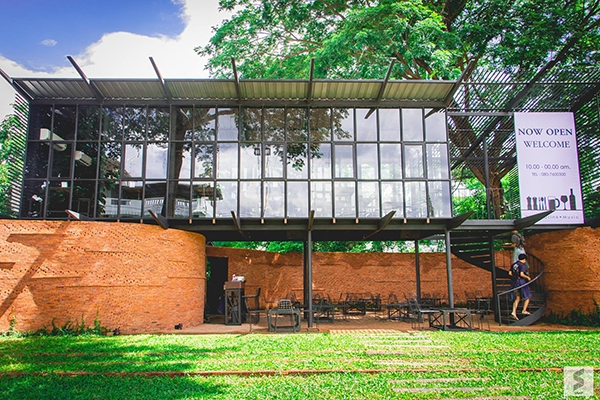

*อ้างอิงภาพจาก :* [MiniMo](http://www.painaidii.com/diary/diary-detail/004038/lang/th/)

>Snap Cafe’ Snap Cafe’ คาเฟ่ในสวน บรรยากาศเท่ๆ ตกแต่งแบบอินดัสเทรียลโชว์ผนังอิฐมอญและเหล็ก มีมุมถ่ายภาพสุดแนว รวมไปถึงเมนูอาหารเครื่องดื่มที่หลากหลายใครอยากได้รูปเท่ๆ โทนสีแนวๆ พร้อมบรรยากาศดีๆ อาหารอร่อยๆ แวะเวียนไปหลังม.ขอนแก่น กันได้เลยจ้า
-ที่ตั้ง : หน้าหอ NP Park หลัง ม.ขอนแก่น อำเภอเมือง จ.ขอนแก่น 40000 
-เบอร์ติดต่อ : 083 284 8872 
-เวลาเปิด-ปิด : เปิดทุกวัน 11.00 - 00.00 น 
-เมนูแนะนำ : มอคค่า, บิงซู, สมูทตี้, อาหารจานเดียว
-ราคาเริ่มต้น : 100 บาทขึ้นไป

#### 10. Newbury Coffee House
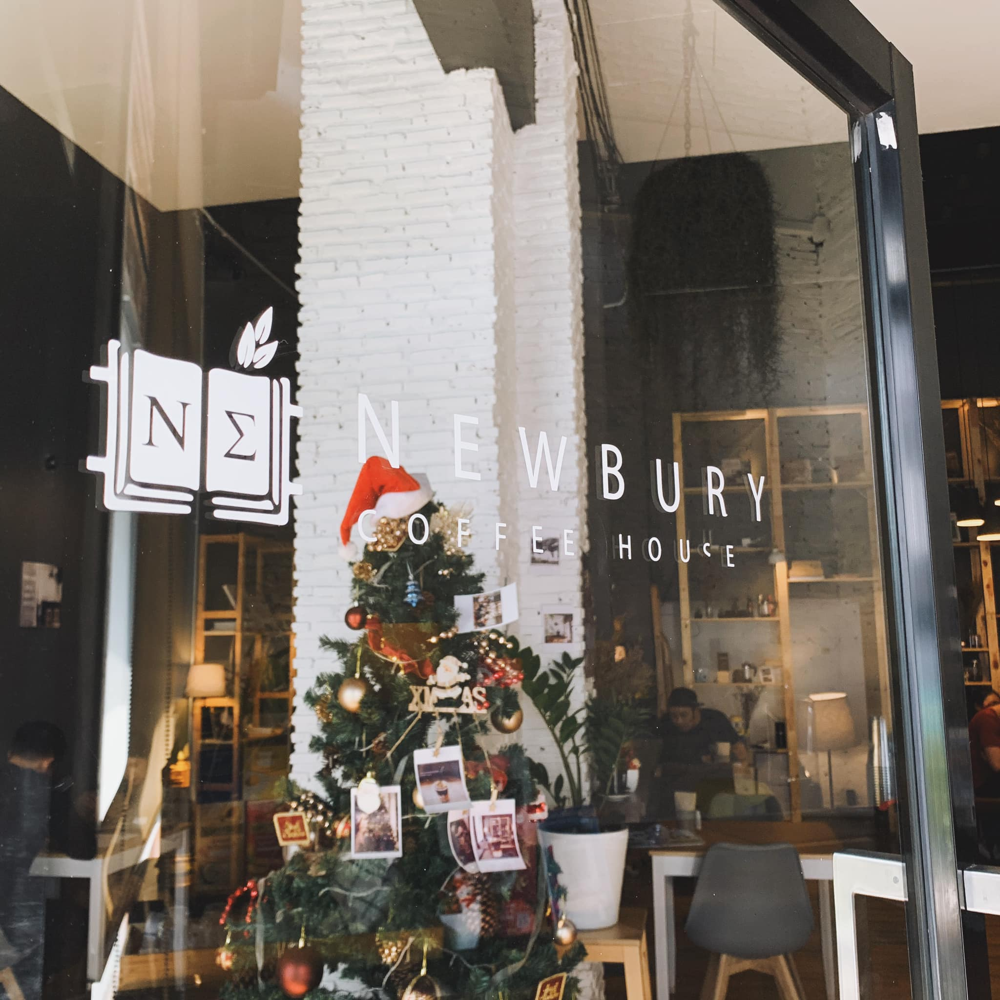
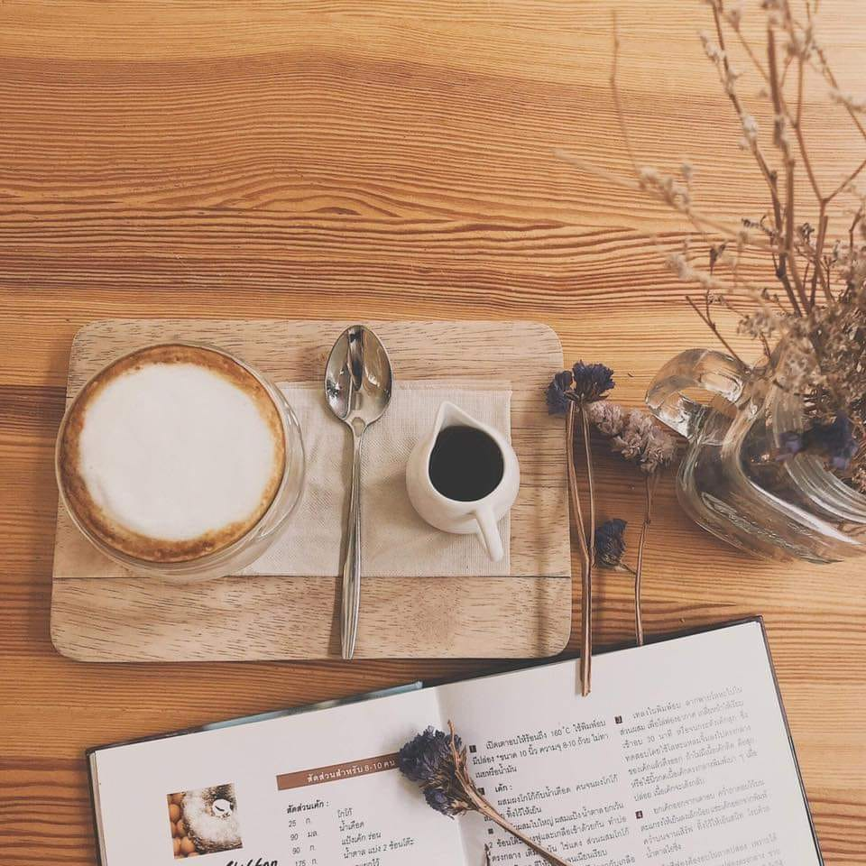
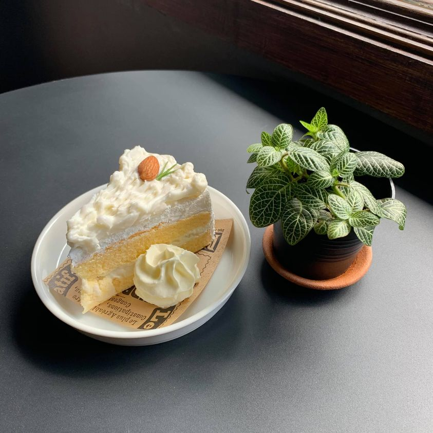

*อ้างอิงภาพจาก:* [Facebook Newbury Coffee House](https://www.facebook.com/newburycoffeehouse)
>Newbury Coffee House เป็นร้านที่มีเครื่องดื่มและของหวานให้เลือกชิมมากมาย ตกแต่งสวยงามและเป็นร้านที่เหมาะแก่การมาหนังอ่านหนังสือหรือทำงานสบาย ๆ 

- พิกัด:  ซอย อดุลยาราม 1 ขอนแก่น (ฝั่งกังสดาล)
- เวลาเปิด-ปิด: 11.00 - 22.30 น. เว้นวันศุกร์ 11.00 - 18.00 น.
- เมนูแนะนำ: กาแฟ, ชาเขียวปั่น

#### 11. Cafe de' Forest มหาวิทยาลัยขอนแก่น

*อ้างอิงภาพจาก :* [Facebook Cafe de' Forest มหาวิทยาลัยขอนแก่น](https://www.facebook.com/Coffeekku)

>คาเฟ่บรรยากาศสวนที่ทำให้การดื่มกาแฟท่ามกลางธรรมชาติเป็นเรื่องง่าย ตั้งอยู่ในมหาวิทยาลัยขอนแก่น การเดินทางสะดวก ภายในร้านออกแบบให้สามารถจิบกาแฟได้ทั้งในห้องแอร์และในสวน พร้อมเสิร์ฟเมนูอาหารคาวและของหวานรสชาติดี ราคาไม่แพง

- ที่ตั้ง : 123 อาคารแก่นกัลปพฤกษ์ ม.ขอนแก่น เมืองขอนแก่น ขอนแก่น 40002
- เบอร์ติดต่อ : 093 556 5129
- เวลาเปิด-ปิด : เปิดทุกวัน 08.00 - 17.00 น 
- ราคาเริ่มต้น : 100 บาทขึ้นไป

### 12. Rest House cafe
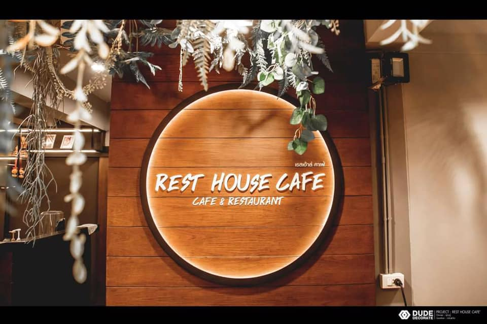
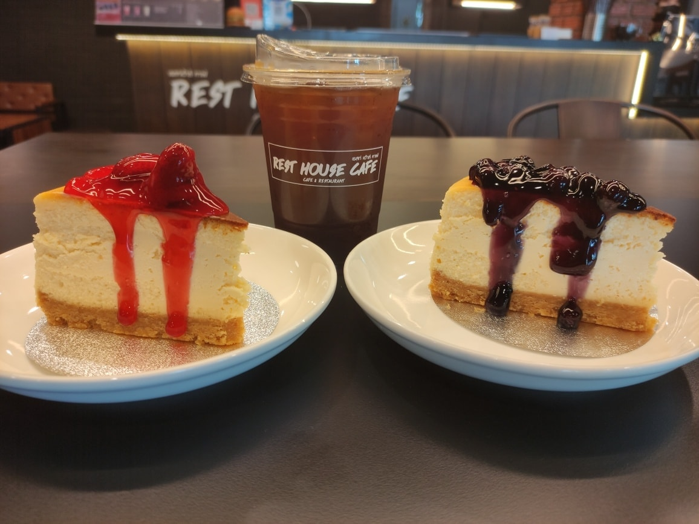
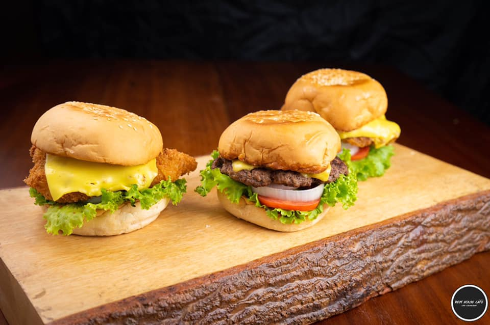

*อ้างอิงภาพจาก:* [Facebook REST HOUSE CAFE'](https://www.facebook.com/REST-HOUSE-CAFE-103375744848307/?ref=page_internal)

>คาเฟ่โซนหลังมอ เยื้องๆเจนหมูกระทะ ร้านบรรยากาศอบอุ่น เหมาะกับนั่งทำงาน อ่านหนังสือ
ที่ร้านมีอาหาร และเครื่องดื่มให้เลือกมากมาย ที่สำคัญอร่อยมาก และยังมีชั้น2 เปิดโล่งให้รับบรรยากาศ จะนั่งชิลหรือทำงานก็แจ๋ว

- ที่ตั้ง : บ้านโนนม่วง เยื้องๆกับเจนหมูกระทะ
- เบอร์ติดต่อ : 097-257-5777
- เวลาเปิด-ปิด : เปิดทุกวัน 10.00-24.00 น.

#### 13. cocoa more

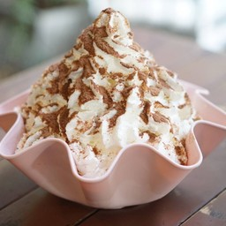

*อ้างอิงข้อมูลและภาพจาก:* [wongnai](https://www.wongnai.com/restaurants/180300gu-cocoa-more)

>เป็นที่รู้จักกันดีสำหรับชาว มข. รสชาติโกโก้เข้มข้ม เมนูทีเด็ดของร้านจะเป็นไอซ์เบิร์ก กินกี่ครั้ง ก็ฟินได้ทุกครั้ง นอกจากนี้ยังมีอย่างอื่น ขนมนมเนยแถมยังมี wifi ไว้คอยนั่งทำงานอีก ใครที่ยังไม่เคยลอง ต้องปักหมุดไว้เลย 

>พิกัด : ถนน คสล. บ้านโนนม่วง ขอนแก่น (หลัง มข. ออกประตู U Center เลี้ยวซ้าย เลยร้าน See Bear ไปหน่อยนึง) อ่านต่อได้ที่ https://www.wongnai.com/restaurants/180300gu-cocoa-more?ref=ct
 
>เวลาเปิด-ปิด 16.00 - 00.00 น.

#### 14. Class Cafe

*อ้างอิงข้อมูลและภาพจาก:* [wongnai](https://www.wongnai.com/restaurants/292465li-class-cafe)

> พิกัด : อยู่ถนนมะลิวัลย์ ตัดกับถนนมิตรภาพ แถวสามเหลี่ยม ตรงข้ามโชวรูมรถ Mitsubishi ร้านอยู่ถ.มะลิวัลย์ ฝั่งทางจะออกไปสนามบิน ก่อนถึงหน้ามหาวิทยาลัยขอนแก่น
> เวลาเปิด-ปิด : 24 ชั่วโมง
> มีบริการเดลิเวอรี่และนั่งทานที่ร้าน บรรยากาศดี เหมาะกับนั่งทำงานและอ่านหนังสือ

#### 15. Playground cafe'
> Playground cafe' คาเฟ่ดีๆที่คุณไม่ควรพลาด ที่มาพร้อมกับบรรยากาศร้านสวยๆ พร้อมกับอาหารและเครื่องดื่มมากมายที่แสนอร่อย เหมาะกับการนั่งอ่านหนังสือ และนั่งเล่น 
*อ้างอิงข้อมูลและภาพจาก: (https://www.facebook.com/Playground-cafe-103426907942197/photos/?ref=page)

เปิดให้บริการ : 10.00 - 22.00 น. 
โทรศัพท์ : 085 609 3853
พิกัด : หลังมอ ใกล้หอพัก ดิออโรร่า 
Google Map : https://goo.gl/maps/VAjqgKFCtE53V5sx9) 
การชำระเงิน : รับเงินสด , QR-Payment

### 16. Inwhite cafe 
 
 
 
 *แหล่งอ้างอิง: > [facebook](https://www.facebook.com/inwhitecafekk)
  
>  เป็นร้านคาเฟ่ที่ตั้งอยู่บริเวณฝั่งกังสดาล มหาวิทยาลัยขอนแก่น ใกล้ๆตลาด 62 บล็อค 
>  มีทั้งอาหารเครื่องดื่มรวมทั้งขนมปังที่แสนอร่อย อีกอย่างร้านนี้เข้าร่วมโครงการคนล่ะครึ่งอีกด้วย 

#### 17. Board Game Everyday Cafe

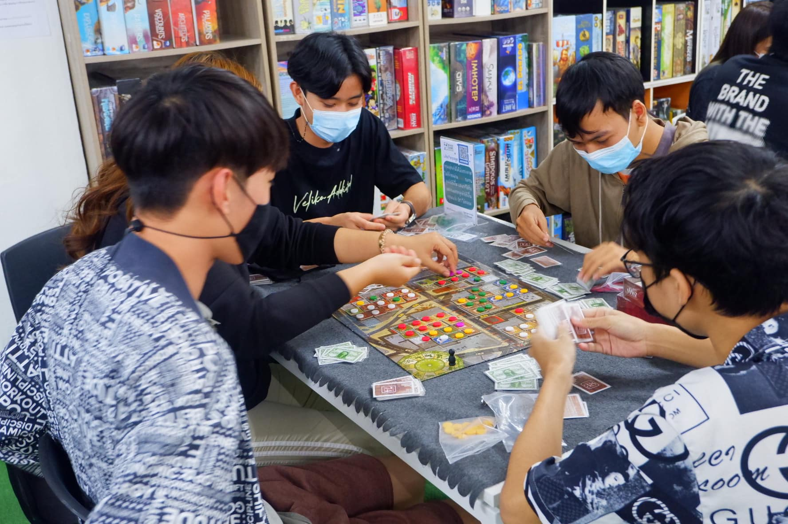
*อ้างอิงข้อมูลและภาพจาก:* [Facebook Board Game Everyday Cafe](https://www.facebook.com/BoardGameEverydayCafe/)

>พิกัด : อยู่หน้า โรงอาหาร U-Center อยู่ระหว่างร้าน 7-eleven และ ร้านเม้งทุกอย่าง
>เวลาเปิด-ปิด : 13.00น. - 23.59น.
>มีบอร์ดเกมส์ให้เล่นมากมาย แอร์เย็นสะบายๆ และค่าบริการที่ถูก

#### 18. นมวัวบิน หลังมข.

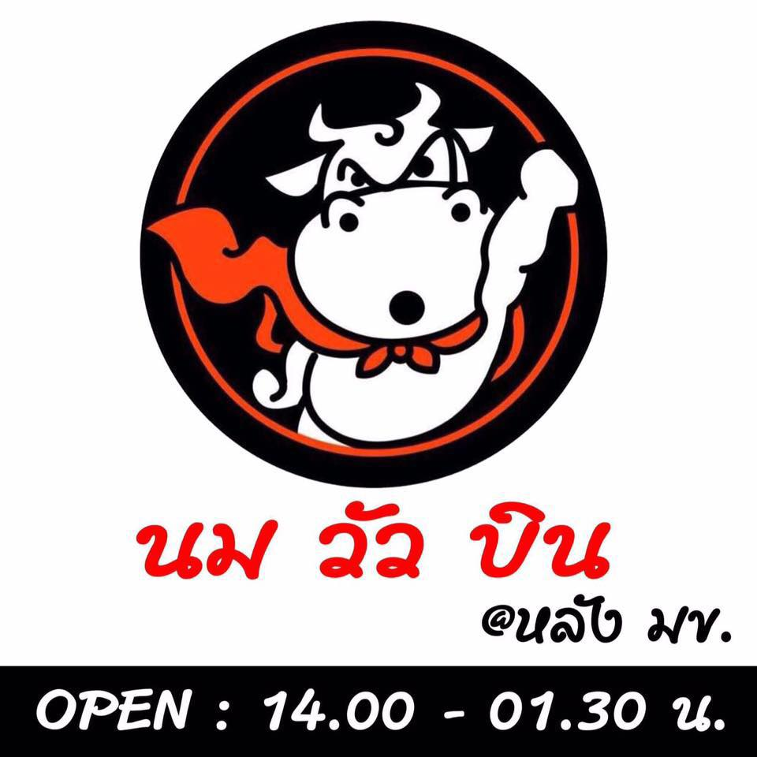
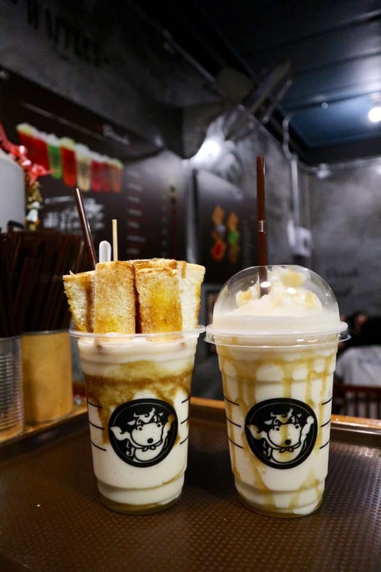
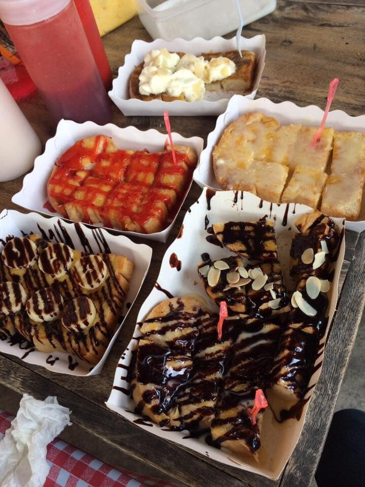

*อ้างอิงภาพจาก:* [Facebook Nomvubin](https://www.facebook.com/Nomvubin)

>ร้านบรรยากาศดีมี 2 ชั้น สามารถขึ้นไปนั่งชิลด้านบนได้ ราคานักศึกษา 20++ เป็นต้นไป

- ที่ตั้ง : ซอย พิมานคอนโดพาร์ค ขอนแก่น (ติดข้างๆร้านก๋วยเตี๋ยว 13 หลัง มข.)
- เบอร์ติดต่อ : 081-266-4012
- เวลาเปิด-ปิด : เปิดทุกวัน 14.00-01.30 น.

## Selfie/Check-in Spots  :camera: :sunflower:
Love to impress you Instragram followers? Here are the places where you can take stunning pictures.
#### 1. รั้วส้ม อาดารวิทยวิภาส คณะวิทยาศาสตร์

> รั้วสีส้มสีสดใส มีทางทอดยาว เหมาะกับการถ่ายภาพ Portrait มากๆ รายการทีวีก็เคยมาถ่ายจุดนี้ มาเช้าๆ รับรอง Selfie ออกมาสวยแน่นอน
> พิกัด: ด้านข้างอาดารวิทยวิภาส คณะวิทยาศาสตร์ ฝั่งติดคณะมนุษยศาสตร์และสังคมศาสตร์

#### 2. พิพิธภัณฑ์ธรรมชาติวิทยา อพ.สธ. - มหาวิทยาลัยขอนแก่น

*อ้างอิงข้อมูลและภาพจาก:* [MUSEUM THAILAND](https://www.museumthailand.com/th/museum/Natural-History-Museum-Khonkean-University)

> พิพิธภัณฑ์ธรรมชาติวิทยา อพ.สธ.โดยจะแบ่งเป็น Zone ได้แก่
- Zone A โถงต้อนรับและประชาสัมพันธ์
- Zone B นิทรรศการเฉลิมพระเกียรติสมเด็จพระเทพรัตนราชสุดาฯ สยามบรมราชกุมารี และโครงการอนุรักษ์พันธุกรรมพืชฯ (อพ.สธ.)
- Zone C นิทรรศการผลงานการสนองพระราชดำริ อพ.สธ. ของมหาวิทยาลัยขอนแก่น
- Zone D นิทรรศการการกำเนิด สุริยจักรวาล
- Zone E นิทรรศการวิวัฒนาการของภาคอีสาน
- Zone F โซนนิทรรศการสรรพสิ่งล้วนพันเกี่ยวนำเสนอโครงสร้างของระบบนิเวศและสังคมป่าแบบต่างๆ ที่พบในภาคตะวันออกเฉียงเหนือ
> เราสามารถไปถ่ายภาพและเดินดูภายในพิพิธภัณฑ์โดยในแต่ละโซนจะมีความแตกต่างกนออกไป

วันและเวลาทำการ
วันอังคาร - อาทิตย์ และวันหยุดนักขัตฤกษ์
เวลา  10.00 - 20.00 น.

#### 3. “แปลงกังหัน ทุ่งดอกไม้นานาพรรณ” ณ หมวดพืชไร่ คณะเกษตรศาสตร์

>   ด้วย นักศึกษา สาขาวิชาพืชไร่ คณะเกษตรศาสตร์ มหาวิทยาลัยขอนแก่น จำนวนกว่า 700 คน ได้จัดทำ “แปลงกังหัน ทุ่งดอกไม้นานาพรรณ และจุดถ่ายภาพ” และกิจกรรมมากมาย เพื่อร่วมแสดงความยินดี และภาคภูมิใจให้กับพี่บัณฑิตของมหาวิทยาลัยขอนแก่น สร้างความประทับใจให้กับญาติมิตรบัณฑิตทุกท่าน ที่มาเยือน มข.

อีกทั้งยังเป็นการเพื่อฝึกทักษะ และให้นักศึกษาได้เห็นมุมมองการเป็นผู้ประกอบการ ในการสร้างแหล่งท่องเที่ยว เพื่อสร้างภาพลักษณ์ของคณะเกษตรศาสตร์ และมหาวิทยาลัยขอนแก่นให้กับบุคคลทั่วไปได้รู้จักมากยิ่งขึ้น

มหาวิทยาลัยขอนแก่น จึงใคร่ขอเชิญชวนทุกท่าน ผู้ที่ชอบดอกไม้ และธรรมชาติ รวมถึงผู้ที่รักในการถ่ายภาพ มาร่วมชม “แปลงกังหัน ทุ่งดอกไม้นานาพรรณ” ได้ที่ หมวดพืชไร่ คณะเกษตรศาสตร์ (ตรงข้ามตลาดหอแปดหลัง) ในวันที่ 5 ธันวาคม 2563 เป็นต้นไป

ทั้งนี้ได้มีการเก็บค่าเข้าชม เพียงท่านละ 20 บาท ส่วนท่านที่อายุเกิน 55 ปี และเด็กอายุต่ำกว่า 15 ปี เข้าชมฟรี! โดยรายได้ทั้งหมด จะนำใช้ในกิจกรรมของนักศึกษา การพัฒนาหมวดพืชไร่ และเป็นทุนในการจัดแปลงกังหันในปีต่อไป

อ้างอิงข้อมูลและภาพจาก: [kku.ac.th](https://th.kku.ac.th/40604/)

#### 4.Columbo Craft Village

อ้างอิงข้อมูลแลภาพจาก: [TRAVEL MTHAI](https://travel.mthai.com/blog/165077.html)

>“Coloumbo Craft Village” จังหวัดขอนแก่น เพิ่งก่อตั้งในปี 2017 นี้เอง เกิดจากการรวมตัวของกลุ่มเพื่อน 8 คนที่หลงรักในงานศิลปะ และอยากหาสถานที่ไว้โชว์ไอเดียความคิดสร้างสรรค์ของแต่ละคน จึงมาลงตัวที่ หมู่บ้านเล็กๆ ณ “โคลัมโบ ซอย 1” ข้างมหาวิทยาลัยของแก่น กำเนิดเป็นบ้านหลังเล็กๆ  6 หลัง คือ Do Homemade ร้านกาแฟที่มีการชงแบบสโลว์บาร์, Numgunde (นำกันเด๊ะ) ซึ่งมีกระเป๋า หมวก และของใช้กระจุ๊กกระจิ๊กทำจากผ้าสีสันสดใส บางครั้งก็เปิด Workshop สอนเย็บเสื้อผ้า กระเป๋า ให้กับผู้ที่สนใจด้วย,  YUB shop แกลเลอรี่โชว์ผลงานและขายงาน รวมถึงรับวาดรูปนักท่องเที่ยวที่มาเยี่ยมชมในรูปแบบโปสการ์ดด้วย,  Woodhaus ซึ่งรับออเดอร์งานไม้และผ้าปักที่มีลวดลาย, Clay More ร้านเซรามิคและกระถางต้นไม้ดินเผาสุดน่ารัก, 1309 Handcraft Cuisine ร้านอาหารเรือนกระจก

- Facebook: [Columbo craft village](https://www.facebook.com/Columbocraftvillage/)

- วันเวลาเปิด-ปิด: เปิดทุกวัน ยกเว้นวันอังคาร ตั้งแต่เวลา 08.00 –23.00น. 
- ที่ตั้ง: 674 บ้านโนนม่วง หมู่ 19 ตำบลศิลา อำเภอเมืองฯ จังหวัดขอนแก่น

## Free Stuffs :moneybag: :innocent:
On budget? No problem. There are free stuffs and events for you to enjoy around KKU.

#### 1. KKU Smart Transit

*อ้างอิงข้อมูลและภาพจาก:* [KKUSmaratTransit](https://kst.kku.ac.th/)

> รถ shuttle bus ใหม่มข. ย้ำนโยบาย Green & Smart Campus กับบริการที่จะทำให้ชีวิตคนมข.และประชาชนที่ใช้บริการต่างๆของมข.ดีขึ้น

⇒ มีตารางเดินรถที่แน่นอน โดยติด GPS ที่รถทุกคัน

⇒ แสดงเวลาถึงป้ายจอดแบบ realtime มีจอ led ทุกสถานีจอด และผู้ใช้ดูได้ผ่านแอปพลิเคชัน

⇒ รถประกอบขึ้นใหม่เอี่ยม

⇒ มี wifi ฟรี

⇒ รูปแบบทันสมัย แบบ low floor

⇒ เป็นรถปรับอากาศ

⇒ มีการวัดสถิติผู้ใช้บริการผ่านเทคโนโลยี rfid ซึ่งจะทำให้ทราบความต้องการที่แท้จริง

⇒ ใช้ก๊าส NGV ช่วยชาติลดพลังงาน

⇒ ที่สำคัญฟรีสำหรับทุกคน ทั้งชาวมข.และประชาชนทั่วไป

## Public Events :dancer: :dancers:
KKU is full of public events. Some are free. Some are not. Here are the list.
#### 1. Sithan Festival

*อ้างอิงข้อมูลและภาพจาก:* [KhonKaenLink](https://www.khonkaenlink.info/home/news/9291.html)

*อ้างอิงข้อมูลและภาพจาก:* [KhonKaenLink](https://www.khonkaenlink.info/home/news/9291.html)

> มข.สืบสานลอยกระทง จัดใหญ่ "KKU Festival" อลังการงานประเพณี ต้นแบบการปลุกชีวิตให้วัฒนธรรม “บุญสมมาบูชานาค” ปลุกกระแสความเชื่อตามฮีคคองอีสานบนรูปแบบใหม่ของวัฒนธรรมสร้างสรรค์อย่างครบรส "ศรัทธา มหาสนุก ปลุกวิถีวัฒนธรรม"

 ประเพณีไทยเป็นการกระทำกิจกรรมทางสังคมที่ผู้คนส่วนใหญ่ถือปฎิบัติสืบต่อกันมา โดยมีความเชื่อเป็นสิ่งยึดเหนี่ยว เช่น แม่พระธรณี พระแม่โพสพ และ แม่พระคงคา ได้ให้ที่อยู่อาศัย ให้ความสมบูรณ์แก่ไร่นา ให้ได้อาบได้กิน ดังนั้นจึงได้มีประเพณีลอยกระทง เพื่อสร้างบุญ แผ่กุศล สืบต่ออายุพระพุทธศาสนา จวบจนปัจจุบัน เมื่อถึงเดือนพฤศจิกายนของทุกปี ซึ่งตรงกับวันขึ้น 15 ค่ำ เดือน 12 ตามปฎิทินจันทรคติไทย งานประเพณีที่เรียกกันจนคุ้นหู และมีชื่อเป็นทางการว่า "งานลอยกระทง" กระทั่ง สภามหาวิทยาลัยขอนแก่นจึงได้มีการจัด "งานสีฐานเฟสติวัล" คือ ต้นแบบของการนำแนวคิดวัฒนธรรมสร้างสรรค์มาใช้ในการดำเนินกิจกรรมของงานประเพณีลอยกระทง
 บึงสีฐานที่มีคู่กับมหาวิทยาลัยขอนแก่นมาช้านาน สู่กิจกรรมที่ใช้ชื่อใหม่ที่ฟังติดหูนักท่องเที่ยวมากขึ้นสามารถดึงผู้คนให้หลั่งไหลเข้ามาสัมผัสกลิ่นไอวัฒนธรรมแบบผสมผสานนับเป็นเรือนแสนในแต่ละปี ที่โดดเด่นด้วยธีมงาน 3 วันที่ครบรสคือ “ศรัทธา มหาสนุก ปลุกวิถีวัฒนธรรม”

#### 2.Art Lane

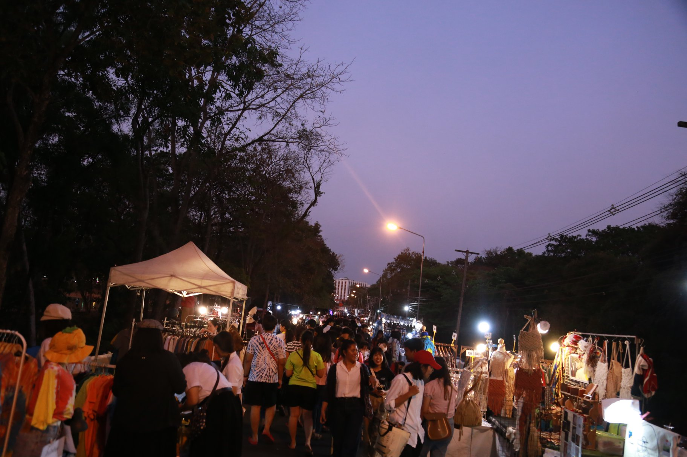

*อ้างอิงข้อมูลและภาพจาก:* [khonkaenuniversity](https://www.khonkaenuniversity.in.th/15078/)

>Art Lane หรือ ถนนศิลปะ จัดขึ้นในช่วงต้นปี โดยจัดขึ้นบริเวณสะพานขาว มหาวิทยาลัยขอนแก่น เพื่อเป็นพื้นที่สำหรับเเสดงผลงานของนักศึกษาและถ่ายทอดความรู้ด้านต่างๆ ของแต่ละสาขาวิชาที่เปิดสอนภายในคณะศิลปกรรมศาสตร์ โดยกิจกรรมนี้มีทั้งการขายสินค้าเเฮนด์เมดของนักศึกษา อาหาร และเครื่องดื่ม รวมไปถึงการแสดงผลงานด้านศิลปะอีกด้วย

#### 3. งานเกษตรภาคอีสาน เกษตรแฟร์ มข.

*อ้างอิงข้อมูลและภาพจาก :* [เที่ยวจนวันลาหมด](https://www.facebook.com/tiewjonwanlamhott/posts/1983277411925417)

*อ้างอิงข้อมูลและภาพจาก :* [เที่ยวจนวันลาหมด](https://www.facebook.com/tiewjonwanlamhott/posts/1983277411925417)

> งานเกษตรภาคอีสาน หรืองานเกษตรแฟร์ มข. เป็นงานแสดงผลผลิตทางการเกษตรที่จัดแสดงขึ้นในทุก ๆ ปี
ซึ่งจัดแสดงเกี่ยวกับการเกษตร ไม่ว่าจะเป็นซุ้มพืชผัก ผลไม้ ประมง พชไร่ พืชสวน เป็นต้น
นอกเหนือจากนี้ งานเกษตรแฟร์ยังมีร้านขายอาหาร ผลไม้และผลผลิตทางการเกษตรมากมาย เช่น องุ่น มะม่วง สตรอวเบอร์รี่ แคบหมู หรือร้านขายต้นไม้ เป็นต้น

## Sporting :running: :muscle:
Here are sporting locations and activities for those who like to sweat.

#### 1. สระพลาสติก

*อ้างอิงข้อมูลและภาพจาก:* [สายวิ่งบันเทิง](https://web.facebook.com/EnjoyToRun/photos/สระพลาสติก-มขอนแก่นความเป็นมาสร้างขึ้นในปี-พศ-2530-เป็นส่วนหนึ่งของสวนร่มเกล้ากั/1801772276798349/?_rdc=1&_rdr)

> ระยะทางหนึ่งรอบ 800 เมตร พื้นสนามเป็นถนนลาดยาง
เวลาเปิด-ปิด : เปิดตลอดเวลา  
> พิกัด: อยู่ระหว่าง สนามกีฬา 50 ปี คณะเทคโนโลยี ตึกอธิการบดีและอยู่ติดกับสะพานขาว

#### 2. สนามกีฬา 50 ปี มหาวิทยาลัยขอนแก่น

>     เป็นสนามกีฬาที่ใช้ทำการแข่งขันกีฬาและจัดกิจกรรมของมหาวิทยาลัยขอนแก่น

อ้างอิงจาก : [EnjoyToRun](https://www.facebook.com/EnjoyToRun/photos/%E0%B8%AA%E0%B8%99%E0%B8%B2%E0%B8%A1%E0%B8%81%E0%B8%B5%E0%B8%AC%E0%B8%B2-50-%E0%B8%9B%E0%B8%B5-%E0%B8%A1%E0%B8%AB%E0%B8%B2%E0%B8%A7%E0%B8%B4%E0%B8%97%E0%B8%A2%E0%B8%B2%E0%B8%A5%E0%B8%B1%E0%B8%A2%E0%B8%82%E0%B8%AD%E0%B8%99%E0%B9%81%E0%B8%81%E0%B9%88%E0%B8%99%E0%B9%80%E0%B8%9B%E0%B9%87%E0%B8%99%E0%B8%AA%E0%B8%99%E0%B8%B2%E0%B8%A1%E0%B8%81%E0%B8%B5%E0%B8%AC%E0%B8%B2%E0%B8%97%E0%B8%B5%E0%B9%88%E0%B9%83%E0%B8%8A%E0%B9%89%E0%B8%97%E0%B8%B3%E0%B8%81%E0%B8%B2%E0%B8%A3%E0%B9%81%E0%B8%82%E0%B9%88%E0%B8%87%E0%B8%82%E0%B8%B1%E0%B8%99%E0%B8%81%E0%B8%B5%E0%B8%AC%E0%B8%B2%E0%B9%81%E0%B8%A5%E0%B8%B0%E0%B8%88%E0%B8%B1%E0%B8%94%E0%B8%81%E0%B8%B4%E0%B8%88%E0%B8%81%E0%B8%A3%E0%B8%A3%E0%B8%A1/1801772270131683/)
> สถานที่ตั้ง : มหาวิทยาลัยขอนแก่น
> https://goo.gl/maps/4v9bNAfVgYF2 
> ระยะทาง : เป็นลู่วิ่งมาตรฐาน 400 เมตร
> เวลาเปิด-ปิด : ปิดใช้ไฟส่องสว่างเวลา 20.00 น. แต่ยังสามารถวิ่งต่อไปได้
> โดยพอมีแสงสว่างจากไฟสนามบาสเกตบอล 4 สนาม ที่อยู่ใกล้กัน
> ซึ่งเปิดใช้ไฟถึงเวลา เวลา 21.00 น. พื้นสนาม :
> พื้นสนามเป็นลู่วิ่งยางสังเคราะห์

#### 3. อาคารพลศึกษาอเนกประสงค์

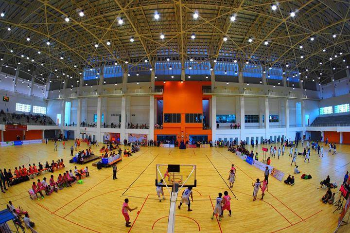

*อ้างอิงข้อมูลและภาพจาก:* [กองการกีฬา](https://www.facebook.com/%E0%B8%81%E0%B8%AD%E0%B8%87%E0%B8%81%E0%B8%B2%E0%B8%A3%E0%B8%81%E0%B8%B5%E0%B8%AC%E0%B8%B2-%E0%B8%A1%E0%B8%AB%E0%B8%B2%E0%B8%A7%E0%B8%B4%E0%B8%97%E0%B8%A2%E0%B8%B2%E0%B8%A5%E0%B8%B1%E0%B8%A2%E0%B8%82%E0%B8%AD%E0%B8%99%E0%B9%81%E0%B8%81%E0%B9%88%E0%B8%99-279812999425193/photos/pcb.740700143336474/740699723336516/)

>อาคารพลศึกษาอเนกประสงค์ เป็นสถานกีฬาขนาดใหญ่ใช้เป็นพื้นที่การออกกำลังกาย เล่นหรือฝึกซ้อมกีฬาหลายชนิดเพื่อรองรับความต้องการสำหรับนักศึกษา บุคลากรในมหาลัยวิทยาลัยขอนแก่น และบุคคลในชุมชนใกล้เคียง  อีกทั้งยังเป็นพื้นที่ฝึกซ้อมสำหรับนักกีฬามหาวิทยาลัยขอนแก่นและเป็นพื้นที่รองรับการจัดการแข่งขันในระดับสากลตั้งแต่กีฬาภายในมหาวิทยาลัยไปจนถึงการแข่งขันระดับประเทศ
> สนามแบดมินตัน 7 สนาม
> สนามตะกร้อ 2 สนาม
> สนามบาสเกตบอล 2 สนาม
> สนามยูโด 1 สนาม
> สนามเทควันโด 1 สนาม
> สนามคาราเต้โด 1 สนาม

##  Shopping :dress: :gift:
Looking for souvenirs or buying the essestials? There are many places for you to go. 

### 1. ตลาดเปิดท้ายหอกาญฯ

*อ้างอิงข้อมูลและภาพจาก:* [Wongnai](https://www.wongnai.com/trips/night-market-khonkaen-university)

> เดินเล่นเช็กอินเเหล่งละลายทรัพย์ของหนุ่มสาวชาวขอนแก่น ช้อปเสื้อผ้าของมือสองแบบจุก ๆ ฟินร้านเด็ดเต็มอิ่ม มาที่เดียวครบ! “ตลาดเปิดท้ายมหาวิทยาลัยขอนแก่น”
> พิกัด : ตลาดเปิดท้ายตั้งอยู่บริเวณลานจอดรถด้านศูนย์ประชุมอเนกประสงค์กาญจนาภิเษก มีเฉพาะ วันศุกร์-อาทิตย์ เวลา17.00-22.00 น. (ไม่ได้มีทุกอาทิตย์)

### 2. ตลาดโนนม่วง 

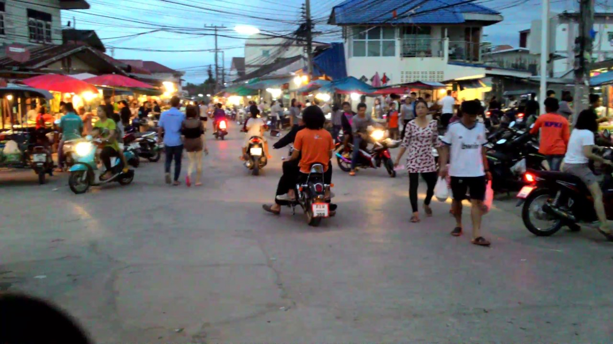

*อ้างอิงข้อมูลและภาพจาก:* [Mongfoto](https://www.youtube.com/watch?v=yIEfThaK2ds)

> เป็นตลาดสำหรับหาอาหาร มีอาหารลากหลายแนวให้เลือกยกตัวอย่างเช่น ส้มตำ ลาบเป็ด ลาบไก่ และผักผลไม้ต่างๆที่ชาวบ้านโนนม่วงปลูกเองแล้วนำมาขาย พ่อค้าแม่ค้าเป็นกันเอง เหมาะสำหรับคนหิวที่อยากกินอาหารต่างๆ
> พิกัด : ตลาดโนนม่วงตั้งอยู่บริเวณ4แยกโนนม่วง (ซอยข้างโลตสเอ็กเพรส) เปิดทุกวัน เวลา16.00-20.30 น. 

### 3. ตลาดมอดินแดง 

*อ้างอิงข้อมูลและภาพจาก:* [dek-d](https://www.dek-d.com/board/view/3412994/)

> เป็นตลาดที่มีความครบเครื่อง ไม่ว่าจะเป็น  อาหาร แฟชั่น เสื้อผ้า เครื่องสำอาง อยู่ที่นี้มีหมด เรียกได้ว่าจบในที่เดียว
> พิกัด : ตลาดมอดินแดงตั้งอยู่บริเวณหลังศุนย์อาหารและบริการ(คอมเพล็ก)เปิดทุกวัน เวลา17.00-21.30 น. 

### 4. ตลาด 62 blocks

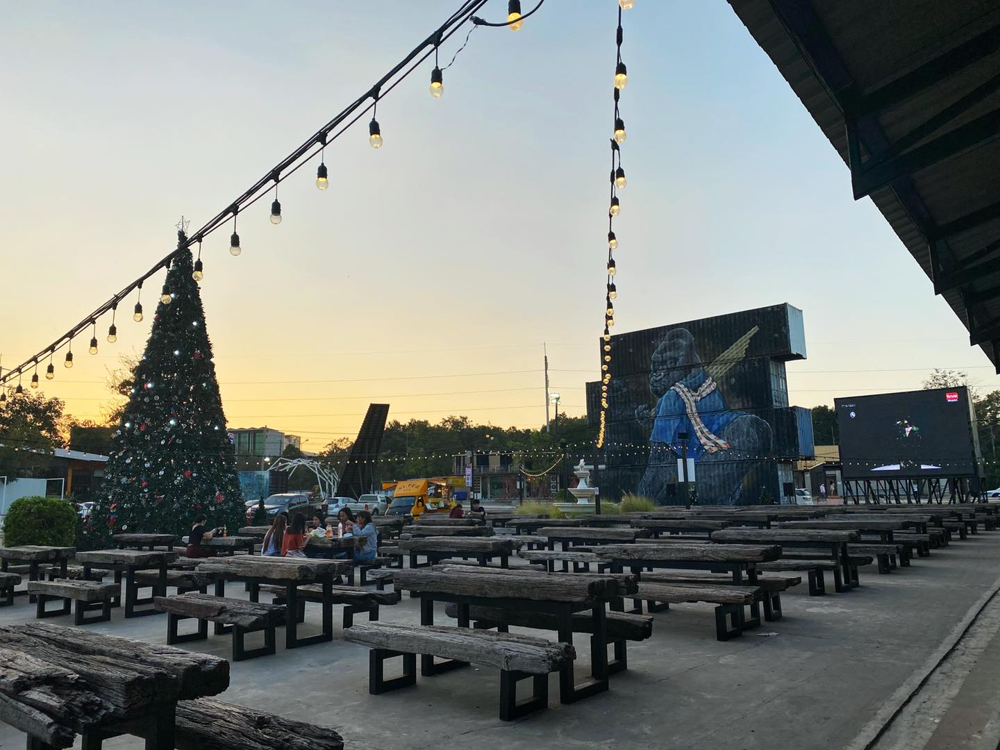
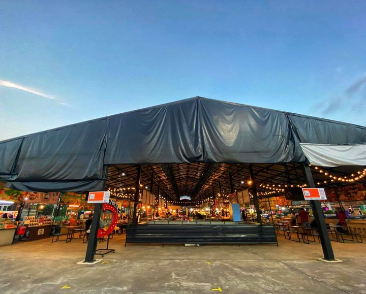

*อ้างอิงข้อมูลและภาพจาก:* [Foodyas](https://www.foodyas.com/TH/Khon-Kaen/143258716285409/%E0%B8%95%E0%B8%A5%E0%B8%B2%E0%B8%9462%E0%B8%9A%E0%B8%A5%E0%B9%87%E0%B8%AD%E0%B8%81-%E0%B8%82%E0%B8%AD%E0%B8%99%E0%B9%81%E0%B8%81%E0%B9%88%E0%B8%99)

> ตลาด62บล็อก ขอนแก่นกินเพลิน เดินชิลล์ ที่ตลาด62 บล็อกขอนแก่น การช้อปปิ้งและค้าปลีก ซึ่งมีร้านค้ามากกว่า150ร้าน 
> พิกัด : 157/89-91 Soi Maha Witthayalai, Mueang Khon Kaen District, Khon Kaen 40000

## Nature and Parks :cow: :evergreen_tree: :evergreen_tree: :horse:
Did you know that KKU has many parks and wild life? Let's get out there for fresh air and some fun.

#### 1. บึงสีฐาน

>   บึงสีฐานเป็นบึงน้ำจืดขนาดเล็ก ที่มีความยาวรอบบึงประมาณ 3 กิโลเมตร เป็นบึงที่อยู่ภายในมหาวิทยาลัยขอนแก่น ฝั่งประตูสีฐานติดกับถนนมะลิวัลย์  และอยู่ติดกับศูนย์ประชุมเอนกประสงค์กาญจนาภิเษก ซึ่งเป็นที่นิยมสำหรับบุตลากรและนักศึกษามหาวิทยาลัยขอนแก่นมาก ส่วนใหญ่นั้นมักจะมาผักผ่อนหย่อนใจ ให้อาหารปลา หรือพาสัตว์เลี้ยงมาเดินเล่นที่บึงแห่งนี้

เวลาเปิด-ปิด : เวลาเปิดไม่แน่ชัด-ปิดเวลา 23.00

