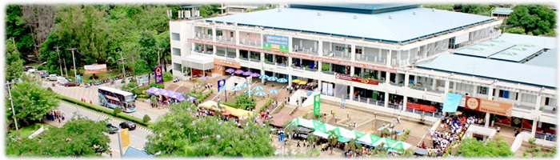
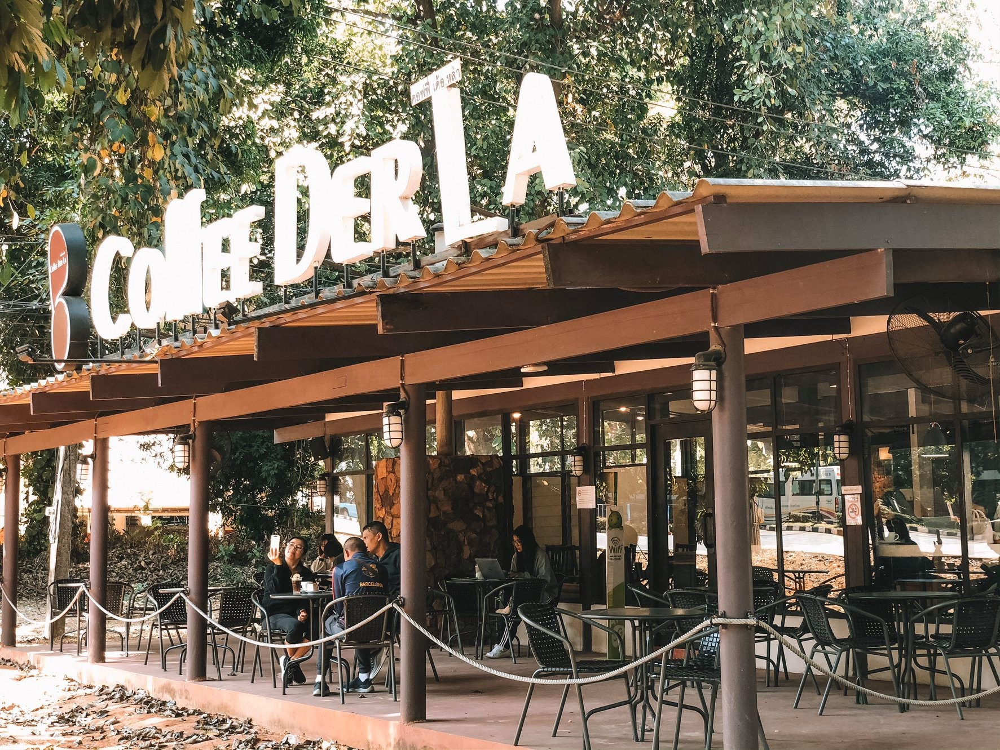
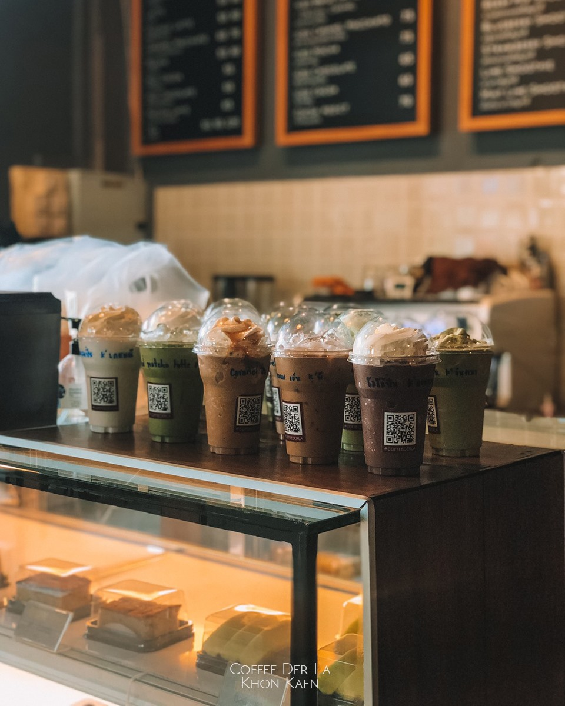
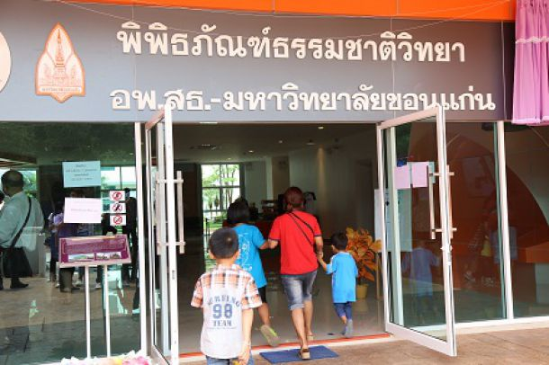
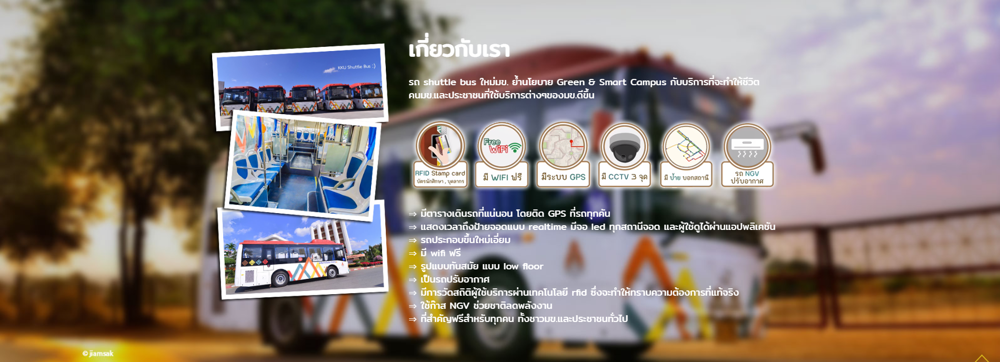
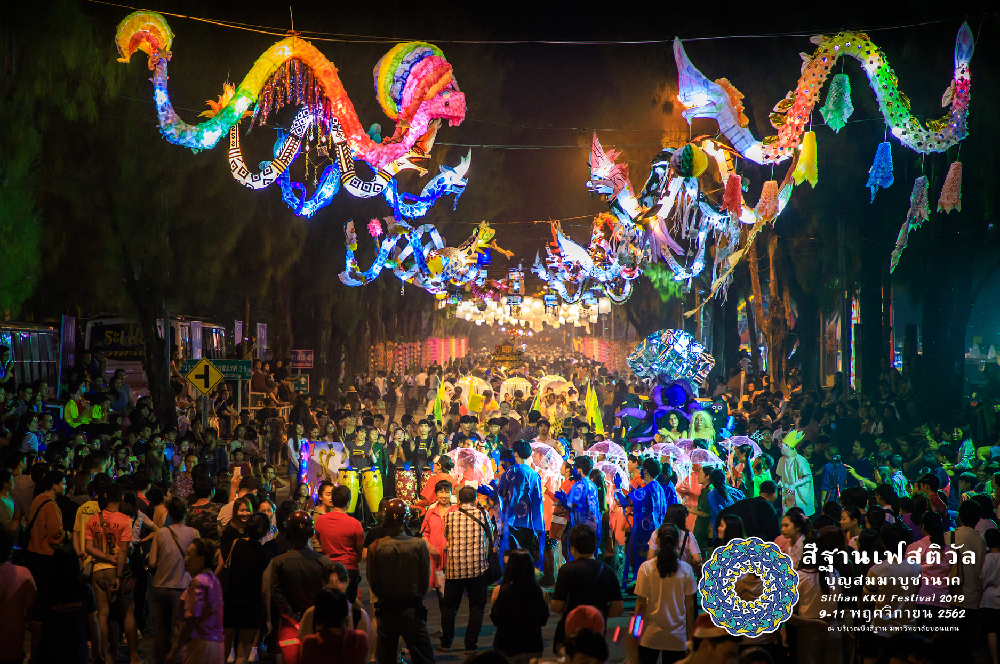
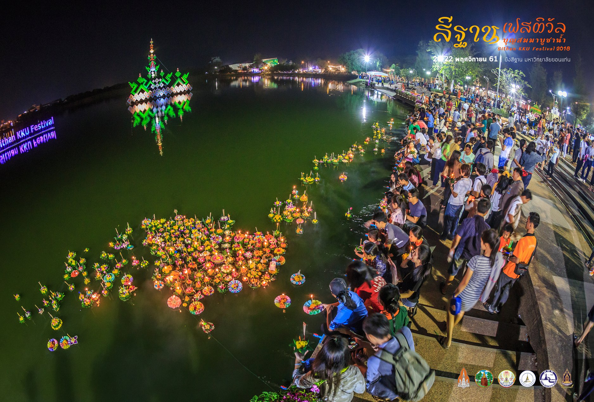
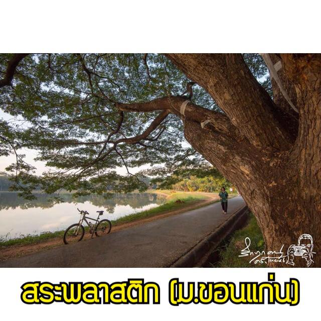
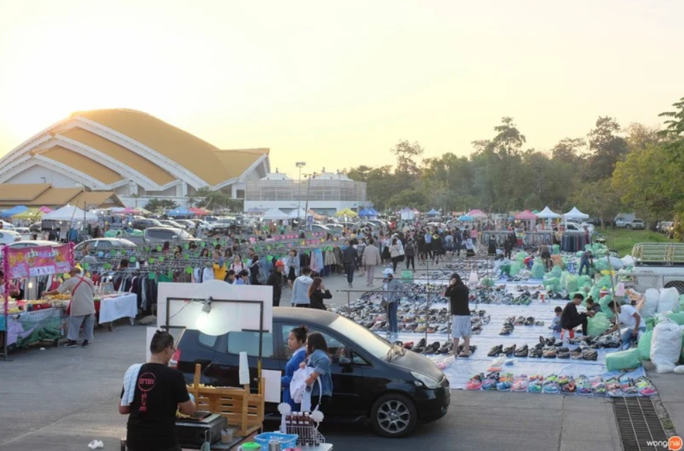
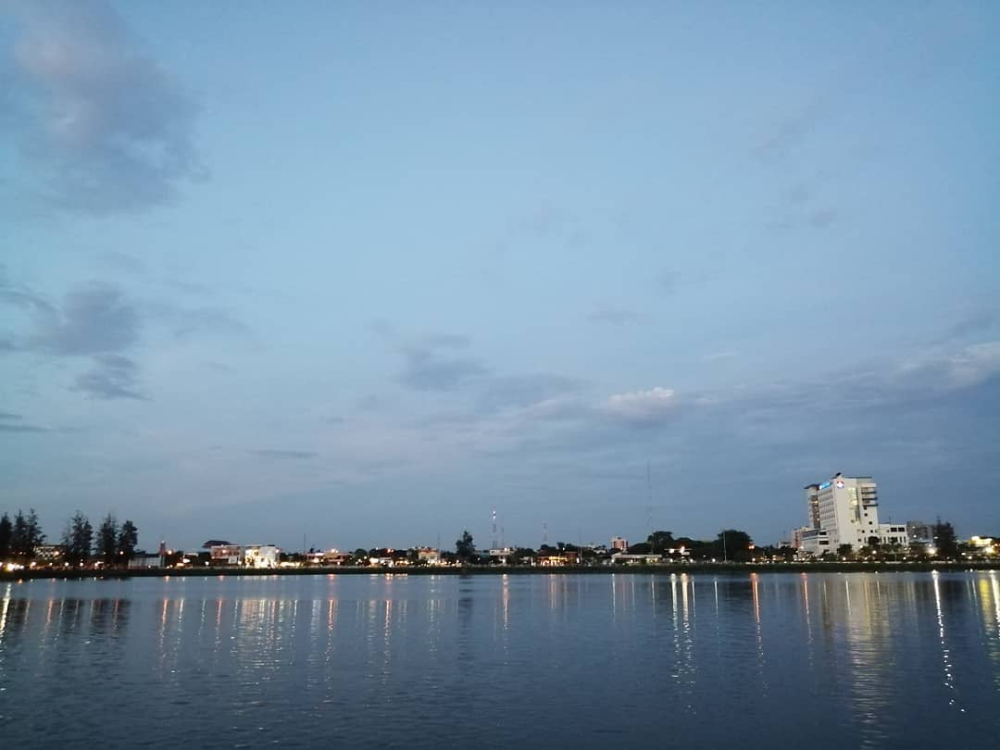

# Wow around KKU 2021
## The ultimate guide to cool things to see and fun stuffs to do around Khon Kaen University

Visiting KKU for the first time? This guide will give you the most enjoyable way to spend your time at KKU through the experience of the locals.

## Quick Links
* [Food](#food)
* [Cafe](#cafe)
* [Selfie/Check-in Spots](#selfie)
* [Free Stuffs](#freestuff)
* [Public Events](#event)
* [Sporting](#sport)
* [Shopping](#shopping)
* [Nature and Parks](#park)

## Food :rice: :ramen:
Best places for all kinds of food.

#### 1. ศุนย์อาหารและบริการ 2 มข. (โรงชาย)
> ถูกและดี มีอยู่จริง!! มีอาหารให้เลือกหลากหลาย ทั้งข้าวราดแกง อาหารตามสั่ง ก๋วยเตี๋่ยว ผลไม้ และขนมหวาน ตั้งแต่ราคาหลักสิบถึงหลักร้อย
พิกัด: เยื้องสนามกีฬากลาง มข.
> เวลาเปิด-ปิด: ตลอดเวลา

#### 2. ศูนย์อาหารและบริการ 1 (คอมเพล็กซ์)

*อ้างอิงภาพจาก:* [ศุนย์บริหารจัดการทรัพย์สินมข.](http://www.asset.kku.ac.th/2015/complex1.php)

 ประเภทที่ให้บริการ
- ร้านอาหารสวัสดิการ จำนวน 26 ร้าน
- ร้านอาหาร เครื่องดื่ม Cafe'
- สำนักงานธนาคารไทยพาณิชย์ ธนาคารกสิกรไทย ธนาคารกรุงไทย ธนาคารกรุงศรีอยุธย
- ร้านสะดวกซื้อ(7 - ELEVEN)
- ศูนย์หนังสือ จำนวน 2 ร้าน
- ร้านให้บริการเสริมความงาม ตัดผมหญิง/ชาย/สปา
- ร้านทั่วไป
    (เช่น : ร้านขายยา /กิ๊ปซ๊อป / ถ่ายเอกสาร / เครื่องเขียน / อปกรณ์ไอที และคอมพิวเตอร์ / การศึกษาต่อต่างประเทศ / โรงเรียนกวดวิชา และสอนพิเศษ/ ร้านจำหน่ายตั๋วการโดยสารเครื่องบิน / อุปกรณ์ไฟฟ้า / ไปรษณีย์ )
- บูธชั่วคราว
    (เสื้อผ้า / กิ๊ฟช้อป / บริการตัดเย็บ / ซ่อมนาฬิกา / เติมเงินและซิมโทรศัพท์มือถือ /เครื่องดื่มและขนมขบเคี้ยว)
- ตู้ ATM   (ไทยพาณิชย์, กรุงไทย , กสิกร , กรุงเทพ)

## Cafe :coffee: :cake: :tea:
Here are the best places where you can enjoy your a cup of coffee and delicious desserts.
#### 1. Coffee Der Lar คอฟฟี่เด้อหล่า - มหาวิทยาลัยขอนแก่น

> ร้านกาแฟในมหาวิทยาลัยขอนแก่น ที่พิถีพิถันในเรื่องของการคัดเลือกเมล็ดกาแฟ อีกทั้งยังมีHomemade Bakery และเครื่องดื่มอื่นๆอีกมากมาย ตอบโจทย์ Lifestyle แบบคนเมือง ในราคาที่คุณดื่มได้ทุกวัน
> ให้บริการ 8.00น. - 20.00น. โทร. 095-6466161

<iframe src="https://www.google.com/maps/embed?pb=!1m18!1m12!1m3!1d956.4925512790026!2d102.8253618292323!3d16.477046285319663!2m3!1f0!2f0!3f0!3m2!1i1024!2i768!4f13.1!3m3!1m2!1s0x0%3A0x0!2zMTbCsDI4JzM3LjQiTiAxMDLCsDQ5JzMzLjMiRQ!5e0!3m2!1sen!2sth!4v1609859524232!5m2!1sen!2sth" width="600" height="450" frameborder="0" style="border:0;" allowfullscreen="" aria-hidden="false" tabindex="0"></iframe>

## Selfie/Check-in Spots  :camera: :sunflower:
Love to impress you Instragram followers? Here are the places where you can take stunning pictures.
#### 1. รั้วส้ม อาดารวิทยวิภาส คณะวิทยาศาสตร์

> รั้วสีส้มสีสดใส มีทางทอดยาว เหมาะกับการถ่ายภาพ Portrait มากๆ รายการทีวีก็เคยมาถ่ายจุดนี้ มาเช้าๆ รับรอง Selfie ออกมาสวยแน่นอน
> พิกัด: ด้านข้างอาดารวิทยวิภาส คณะวิทยาศาสตร์ ฝั่งติดคณะมนุษยศาสตร์และสังคมศาสตร์

#### 2. พิพิธภัณฑ์ธรรมชาติวิทยา อพ.สธ. - มหาวิทยาลัยขอนแก่น

*อ้างอิงข้อมูลและภาพจาก:* [MUSEUM THAILAND](https://www.museumthailand.com/th/museum/Natural-History-Museum-Khonkean-University)

> พิพิธภัณฑ์ธรรมชาติวิทยา อพ.สธ.โดยจะแบ่งเป็น Zone ได้แก่
- Zone A โถงต้อนรับและประชาสัมพันธ์
- Zone B นิทรรศการเฉลิมพระเกียรติสมเด็จพระเทพรัตนราชสุดาฯ สยามบรมราชกุมารี และโครงการอนุรักษ์พันธุกรรมพืชฯ (อพ.สธ.)
- Zone C นิทรรศการผลงานการสนองพระราชดำริ อพ.สธ. ของมหาวิทยาลัยขอนแก่น
- Zone D นิทรรศการการกำเนิด สุริยจักรวาล
- Zone E นิทรรศการวิวัฒนาการของภาคอีสาน
- Zone F โซนนิทรรศการสรรพสิ่งล้วนพันเกี่ยวนำเสนอโครงสร้างของระบบนิเวศและสังคมป่าแบบต่างๆ ที่พบในภาคตะวันออกเฉียงเหนือ
> เราสามารถไปถ่ายภาพและเดินดูภายในพิพิธภัณฑ์โดยในแต่ละโซนจะมีความแตกต่างกนออกไป

วันและเวลาทำการ
วันอังคาร - อาทิตย์ และวันหยุดนักขัตฤกษ์
เวลา  10.00 - 20.00 น.

## Free Stuffs :moneybag: :innocent:
On budget? No problem. There are free stuffs and events for you to enjoy around KKU.

#### 1. KKU Smart Transit

*อ้างอิงข้อมูลและภาพจาก:* [KKUSmaratTransit](https://kst.kku.ac.th/)

> รถ shuttle bus ใหม่มข. ย้ำนโยบาย Green & Smart Campus กับบริการที่จะทำให้ชีวิตคนมข.และประชาชนที่ใช้บริการต่างๆของมข.ดีขึ้น

⇒ มีตารางเดินรถที่แน่นอน โดยติด GPS ที่รถทุกคัน

⇒ แสดงเวลาถึงป้ายจอดแบบ realtime มีจอ led ทุกสถานีจอด และผู้ใช้ดูได้ผ่านแอปพลิเคชัน

⇒ รถประกอบขึ้นใหม่เอี่ยม

⇒ มี wifi ฟรี

⇒ รูปแบบทันสมัย แบบ low floor

⇒ เป็นรถปรับอากาศ

⇒ มีการวัดสถิติผู้ใช้บริการผ่านเทคโนโลยี rfid ซึ่งจะทำให้ทราบความต้องการที่แท้จริง

⇒ ใช้ก๊าส NGV ช่วยชาติลดพลังงาน

⇒ ที่สำคัญฟรีสำหรับทุกคน ทั้งชาวมข.และประชาชนทั่วไป

## Public Events :dancer: :dancers:
KKU is full of public events. Some are free. Some are not. Here are the list.
#### 1. Sithan Festival

*อ้างอิงข้อมูลและภาพจาก:* [KhonKaenLink](https://www.khonkaenlink.info/home/news/9291.html)

*อ้างอิงข้อมูลและภาพจาก:* [KhonKaenLink](https://www.khonkaenlink.info/home/news/9291.html)

> มข.สืบสานลอยกระทง จัดใหญ่ "KKU Festival" อลังการงานประเพณี ต้นแบบการปลุกชีวิตให้วัฒนธรรม “บุญสมมาบูชานาค” ปลุกกระแสความเชื่อตามฮีคคองอีสานบนรูปแบบใหม่ของวัฒนธรรมสร้างสรรค์อย่างครบรส "ศรัทธา มหาสนุก ปลุกวิถีวัฒนธรรม"

 ประเพณีไทยเป็นการกระทำกิจกรรมทางสังคมที่ผู้คนส่วนใหญ่ถือปฎิบัติสืบต่อกันมา โดยมีความเชื่อเป็นสิ่งยึดเหนี่ยว เช่น แม่พระธรณี พระแม่โพสพ และ แม่พระคงคา ได้ให้ที่อยู่อาศัย ให้ความสมบูรณ์แก่ไร่นา ให้ได้อาบได้กิน ดังนั้นจึงได้มีประเพณีลอยกระทง เพื่อสร้างบุญ แผ่กุศล สืบต่ออายุพระพุทธศาสนา จวบจนปัจจุบัน เมื่อถึงเดือนพฤศจิกายนของทุกปี ซึ่งตรงกับวันขึ้น 15 ค่ำ เดือน 12 ตามปฎิทินจันทรคติไทย งานประเพณีที่เรียกกันจนคุ้นหู และมีชื่อเป็นทางการว่า "งานลอยกระทง" กระทั่ง สภามหาวิทยาลัยขอนแก่นจึงได้มีการจัด "งานสีฐานเฟสติวัล" คือ ต้นแบบของการนำแนวคิดวัฒนธรรมสร้างสรรค์มาใช้ในการดำเนินกิจกรรมของงานประเพณีลอยกระทง
 บึงสีฐานที่มีคู่กับมหาวิทยาลัยขอนแก่นมาช้านาน สู่กิจกรรมที่ใช้ชื่อใหม่ที่ฟังติดหูนักท่องเที่ยวมากขึ้นสามารถดึงผู้คนให้หลั่งไหลเข้ามาสัมผัสกลิ่นไอวัฒนธรรมแบบผสมผสานนับเป็นเรือนแสนในแต่ละปี ที่โดดเด่นด้วยธีมงาน 3 วันที่ครบรสคือ “ศรัทธา มหาสนุก ปลุกวิถีวัฒนธรรม”

## Sporting :running: :muscle:
Here are sporting locations and activities for those who like to sweat.

#### 1. สระพลาสติก

*อ้างอิงข้อมูลและภาพจาก:* [สายวิ่งบันเทิง](https://web.facebook.com/EnjoyToRun/photos/สระพลาสติก-มขอนแก่นความเป็นมาสร้างขึ้นในปี-พศ-2530-เป็นส่วนหนึ่งของสวนร่มเกล้ากั/1801772276798349/?_rdc=1&_rdr)

> ระยะทางหนึ่งรอบ 800 เมตร พื้นสนามเป็นถนนลาดยาง
เวลาเปิด-ปิด : เปิดตลอดเวลา  
> พิกัด: อยู่ระหว่าง สนามกีฬา 50 ปี คณะเทคโนโลยี ตึกอธิการบดีและอยู่ติดกับสะพานขาว

##  Shopping :dress: :gift:
Looking for souvenirs or buying the essestials? There are many places for you to go. 

### 1. ตลาดเปิดท้ายหอกาญฯ

*อ้างอิงข้อมูลและภาพจาก:* [Wongnai](https://www.wongnai.com/trips/night-market-khonkaen-university)

> เดินเล่นเช็กอินเเหล่งละลายทรัพย์ของหนุ่มสาวชาวขอนแก่น ช้อปเสื้อผ้าของมือสองแบบจุก ๆ ฟินร้านเด็ดเต็มอิ่ม มาที่เดียวครบ! “ตลาดเปิดท้ายมหาวิทยาลัยขอนแก่น”
> พิกัด : ตลาดเปิดท้ายตั้งอยู่บริเวณลานจอดรถด้านศูนย์ประชุมอเนกประสงค์กาญจนาภิเษก มีเฉพาะ วันศุกร์-อาทิตย์ เวลา17.00-22.00 น. (ไม่ได้มีทุกอาทิตย์)

## Nature and Parks :cow: :evergreen_tree: :evergreen_tree: :horse:
Did you know that KKU has many parks and wild life? Let's get out there for fresh air and some fun.

#### 1. บึงสีฐาน

>   บึงสีฐานเป็นบึงน้ำจืดขนาดเล็ก ที่มีความยาวรอบบึงประมาณ 3 กิโลเมตร เป็นบึงที่อยู่ภายในมหาวิทยาลัยขอนแก่น ฝั่งประตูสีฐานติดกับถนนมะลิวัลย์  และอยู่ติดกับศูนย์ประชุมเอนกประสงค์กาญจนาภิเษก ซึ่งเป็นที่นิยมสำหรับบุตลากรและนักศึกษามหาวิทยาลัยขอนแก่นมาก ส่วนใหญ่นั้นมักจะมาผักผ่อนหย่อนใจ ให้อาหารปลา หรือพาสัตว์เลี้ยงมาเดินเล่นที่บึงแห่งนี้

เวลาเปิด-ปิด : เวลาเปิดไม่แน่ชัด-ปิดเวลา 23.00

