# Wow around KKU 2021
## The ultimate guide to cool things to see and fun stuffs to do around Khon Kaen University

Visiting KKU for the first time? This guide will give you the most enjoyable way to spend your time at KKU through the experience of the locals.

## Quick Links
* [Food](#food)
* [Cafe](#cafe)
* [Selfie/Check-in Spots](#selfie)
* [Free Stuffs](#freestuff)
* [Public Events](#event)
* [Sporting](#sport)
* [Shopping](#shopping)
* [Nature and Parks](#park)
* [Library](#library)
  
## Food :rice: :ramen:
Best places for all kinds of food.

#### 1. ศุนย์อาหารและบริการ 2 มข. (โรงชาย)
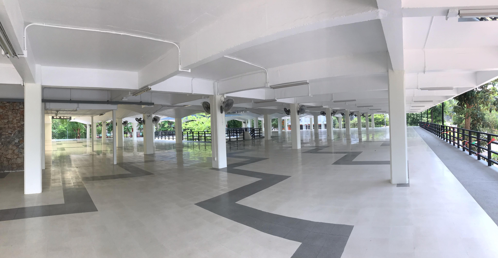

*อ้างอิงข้อมูลและภาพจาก:* [ศุนย์บริหารจัดการทรัพย์สินมข.](http://www.asset.kku.ac.th/2015/complex2.php)

> ถูกและดี มีอยู่จริง!! มีอาหารให้เลือกหลากหลาย ทั้งข้าวราดแกง อาหารตามสั่ง ก๋วยเตี๋่ยว ผลไม้ และขนมหวาน ตั้งแต่ราคาหลักสิบถึงหลักร้อย
พิกัด: เยื้องสนามกีฬากลาง มข.
> เวลาเปิด-ปิด: ตลอดเวลา

#### 2. ศูนย์อาหารและบริการ 1 (คอมเพล็กซ์)

*อ้างอิงภาพจาก:* [ศุนย์บริหารจัดการทรัพย์สินมข.](http://www.asset.kku.ac.th/2015/complex1.php)

 ประเภทที่ให้บริการ
- ร้านอาหารสวัสดิการ จำนวน 26 ร้าน
- ร้านอาหาร เครื่องดื่ม Cafe'
- สำนักงานธนาคารไทยพาณิชย์ ธนาคารกสิกรไทย ธนาคารกรุงไทย ธนาคารกรุงศรีอยุธย
- ร้านสะดวกซื้อ(7 - ELEVEN)
- ศูนย์หนังสือ จำนวน 2 ร้าน
- ร้านให้บริการเสริมความงาม ตัดผมหญิง/ชาย/สปา
- ร้านทั่วไป
    (เช่น : ร้านขายยา /กิ๊ปซ๊อป / ถ่ายเอกสาร / เครื่องเขียน / อปกรณ์ไอที และคอมพิวเตอร์ / การศึกษาต่อต่างประเทศ / โรงเรียนกวดวิชา และสอนพิเศษ/ ร้านจำหน่ายตั๋วการโดยสารเครื่องบิน / อุปกรณ์ไฟฟ้า / ไปรษณีย์ )
- บูธชั่วคราว
    (เสื้อผ้า / กิ๊ฟช้อป / บริการตัดเย็บ / ซ่อมนาฬิกา / เติมเงินและซิมโทรศัพท์มือถือ /เครื่องดื่มและขนมขบเคี้ยว)
- ตู้ ATM   (ไทยพาณิชย์, กรุงไทย , กสิกร , กรุงเทพ)

## Cafe :coffee: :cake: :tea:
Here are the best places where you can enjoy your a cup of coffee and delicious desserts.

#### 1. Class Cafe' โรงชาย มข.

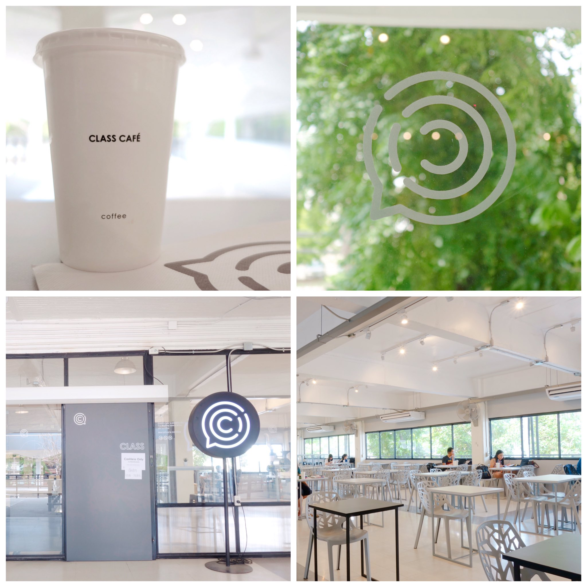

*อ้างอิงข้อมูลและภาพจาก:* [マーク®](https://twitter.com/RollingDMark/status/1276165753088212996)

คาเฟ่มินิมอล ตกแต่งเรียบง่าย ภายในกว้างขวาง เหมาะจะนั่งทำงาน อ่านหนังสือ ถ่ายรูปมุมไหนก็เอาอยู่ ใกล้ๆสนามกีฬากลาง มข.

#### 2. LABrary Cafe'

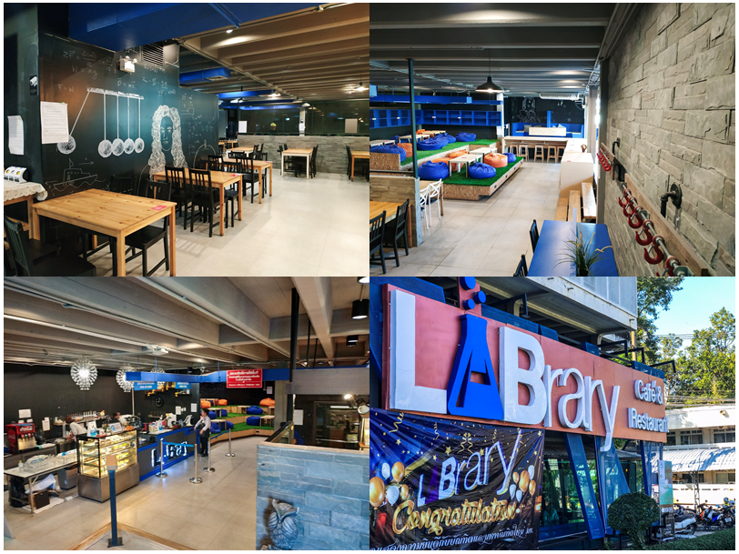

*อ้างอิงข้อมูลและภาพจาก:* [กฤษฎา แก้วผุดผ่อง](https://km.li.mahidol.ac.th/kku-service/)

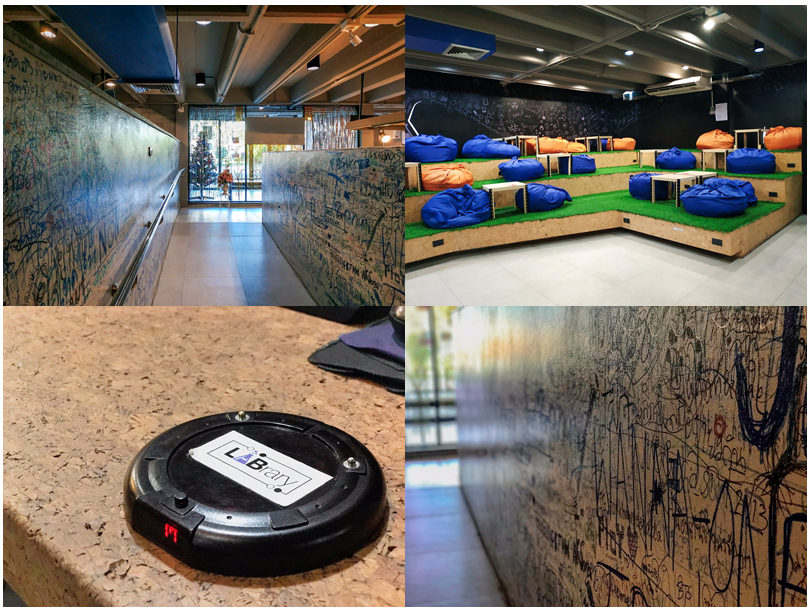

*อ้างอิงข้อมูลและภาพจาก:* [กฤษฎา แก้วผุดผ่อง](https://km.li.mahidol.ac.th/kku-service/)

ร้านคาเฟ่ ที่ชื่อว่า LABrary ตั้งชื่อได้เกร๋มาก ๆ ที่นี่อยู่ติดกับอาคารหอสมุดเลย มีทั้งอาหาร เครื่องดื่ม และที่สำคัญเป็นพื้นที่ที่ออกแบบมาเพื่อนักศึกษาโดยเฉพาะ มีพื้นที่การเรียนรู้ Co-Learning Space จุดที่ผู้เขียนชอบที่สุดของร้านนี้คงจะเป็น บริเวณบันไดทางขึ้นที่ออกแบบกำแพงเป็นพื้นปูนฉาบเรียบ แล้วให้บรรดาแขกที่มาเยี่ยมเยียนร้านได้ขีดเขียนข้อความต่าง ๆ ไว้เป็นที่ระลึก 

## Selfie/Check-in Spots  :camera: :sunflower:
Love to impress you Instragram followers? Here are the places where you can take stunning pictures.
#### 1. รั้วส้ม อาดารวิทยวิภาส คณะวิทยาศาสตร์
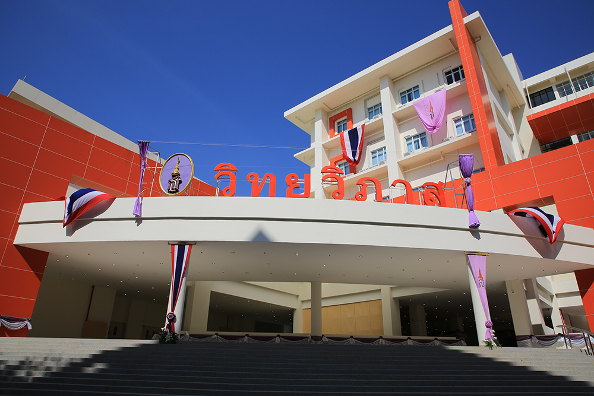

*อ้างอิงข้อมูลจาก:* [ข่าวมข.รายวัน](https://th.kku.ac.th/rl_gallery/%E0%B9%80%E0%B8%9B%E0%B8%B4%E0%B8%94%E0%B8%AD%E0%B8%B2%E0%B8%84%E0%B8%B2%E0%B8%A3%E0%B8%A7%E0%B8%B4%E0%B8%97%E0%B8%A2%E0%B8%A7%E0%B8%B4%E0%B8%A0%E0%B8%B2%E0%B8%AA/)
> รั้วสีส้มสีสดใส มีทางทอดยาว เหมาะกับการถ่ายภาพ Portrait มากๆ รายการทีวีก็เคยมาถ่ายจุดนี้ มาเช้าๆ รับรอง Selfie ออกมาสวยแน่นอน
> พิกัด: ด้านข้างอาดารวิทยวิภาส คณะวิทยาศาสตร์ ฝั่งติดคณะมนุษยศาสตร์และสังคมศาสตร์

#### 2. แปลงกังหัน ทุ่งดอกไม้นานาพรรณ ณ หมวดพืชไร่ คณะเกษตรศาสตร์
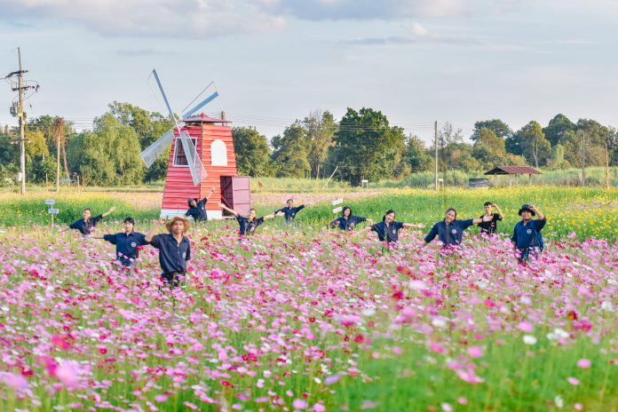

*อ้างอิงข้อมูลและภาพจาก:* [ข่าวมข.รายวัน](https://th.kku.ac.th/40604/)

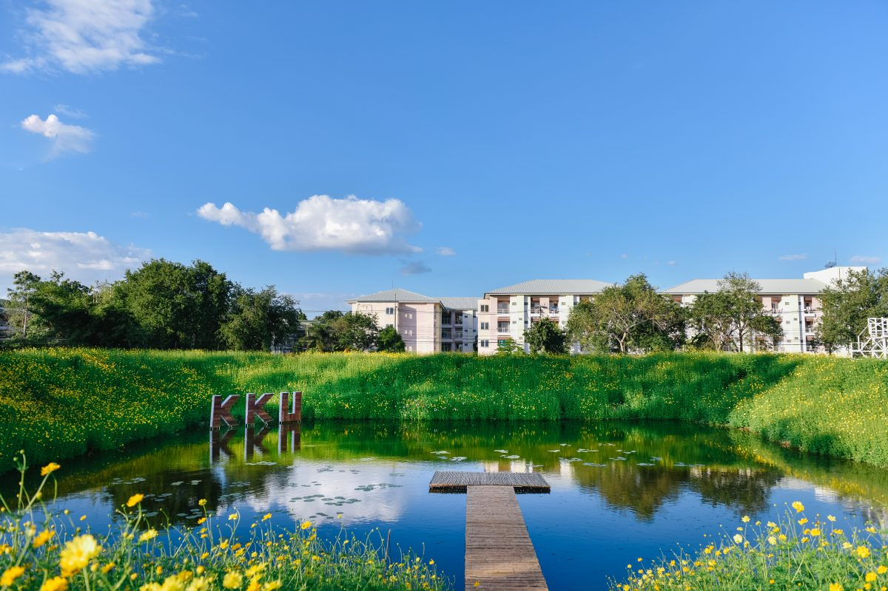

*อ้างอิงข้อมูลและภาพจาก:* [ข่าวมข.รายวัน](https://th.kku.ac.th/40604/)

> เตรียมโทรศัพท์มือถือ เคลียร์เมมโมรี่ให้พร้อม เรามีนัดกันที่แปลงกังหัน ทุ่งดอกไม้สวยๆ ไม่ต้องไปไกลถึงเชียงใหม่ เรายกมาไว้ที่ ม.ขอนแก่น แล้วนะ!

ด้วย นักศึกษา สาขาวิชาพืชไร่ คณะเกษตรศาสตร์ มหาวิทยาลัยขอนแก่น จำนวนกว่า 700 คน ได้จัดทำ “แปลงกังหัน ทุ่งดอกไม้นานาพรรณ และจุดถ่ายภาพ” และกิจกรรมมากมาย เพื่อร่วมแสดงความยินดี และภาคภูมิใจให้กับพี่บัณฑิตของมหาวิทยาลัยขอนแก่น สร้างความประทับใจให้กับญาติมิตรบัณฑิตทุกท่าน ที่มาเยือน มข.

อีกทั้งยังเป็นการเพื่อฝึกทักษะ และให้นักศึกษาได้เห็นมุมมองการเป็นผู้ประกอบการ ในการสร้างแหล่งท่องเที่ยว เพื่อสร้างภาพลักษณ์ของคณะเกษตรศาสตร์ และมหาวิทยาลัยขอนแก่นให้กับบุคคลทั่วไปได้รู้จักมากยิ่งขึ้น

มหาวิทยาลัยขอนแก่น จึงใคร่ขอเชิญชวนทุกท่าน ผู้ที่ชอบดอกไม้ และธรรมชาติ รวมถึงผู้ที่รักในการถ่ายภาพ มาร่วมชม “แปลงกังหัน ทุ่งดอกไม้นานาพรรณ” ได้ที่ หมวดพืชไร่ คณะเกษตรศาสตร์ (ตรงข้ามตลาดหอแปดหลัง) ในวันที่ 5 ธันวาคม 2563 เป็นต้นไป

ทั้งนี้ได้มีการเก็บค่าเข้าชม เพียงท่านละ 20 บาท ส่วนท่านที่อายุเกิน 55 ปี และเด็กอายุต่ำกว่า 15 ปี เข้าชมฟรี! โดยรายได้ทั้งหมด จะนำใช้ในกิจกรรมของนักศึกษา การพัฒนาหมวดพืชไร่ และเป็นทุนในการจัดแปลงกังหันในปีต่อไป

สามารถติดต่อ สอบถามข้อมูล ได้ที่ โทร. 0942595428 น้องปอน ,0648895891 น้องโจ๊ก นักศึกษา สาขาวิชาพืชไร่ คณะเกษตรศาสตร์ มข.

## Free Stuffs :moneybag: :innocent:
On budget? No problem. There are free stuffs and events for you to enjoy around KKU.

#### 1. KKU Smart Transit

*อ้างอิงข้อมูลและภาพจาก:* [KKUSmaratTransit](https://kst.kku.ac.th/)

> รถ shuttle bus ใหม่มข. ย้ำนโยบาย Green & Smart Campus กับบริการที่จะทำให้ชีวิตคนมข.และประชาชนที่ใช้บริการต่างๆของมข.ดีขึ้น

⇒ มีตารางเดินรถที่แน่นอน โดยติด GPS ที่รถทุกคัน

⇒ แสดงเวลาถึงป้ายจอดแบบ realtime มีจอ led ทุกสถานีจอด และผู้ใช้ดูได้ผ่านแอปพลิเคชัน

⇒ รถประกอบขึ้นใหม่เอี่ยม

⇒ มี wifi ฟรี

⇒ รูปแบบทันสมัย แบบ low floor

⇒ เป็นรถปรับอากาศ

⇒ มีการวัดสถิติผู้ใช้บริการผ่านเทคโนโลยี rfid ซึ่งจะทำให้ทราบความต้องการที่แท้จริง

⇒ ใช้ก๊าส NGV ช่วยชาติลดพลังงาน

⇒ ที่สำคัญฟรีสำหรับทุกคน ทั้งชาวมข.และประชาชนทั่วไป

## Public Events :dancer: :dancers:
KKU is full of public events. Some are free. Some are not. Here are the list.

#### 1. Sithan Festival

*อ้างอิงข้อมูลและภาพจาก:* [KhonKaenLink](https://www.khonkaenlink.info/home/news/9291.html)

*อ้างอิงข้อมูลและภาพจาก:* [KhonKaenLink](https://www.khonkaenlink.info/home/news/9291.html)

> มข.สืบสานลอยกระทง จัดใหญ่ "KKU Festival" อลังการงานประเพณี ต้นแบบการปลุกชีวิตให้วัฒนธรรม “บุญสมมาบูชานาค” ปลุกกระแสความเชื่อตามฮีคคองอีสานบนรูปแบบใหม่ของวัฒนธรรมสร้างสรรค์อย่างครบรส "ศรัทธา มหาสนุก ปลุกวิถีวัฒนธรรม"

 ประเพณีไทยเป็นการกระทำกิจกรรมทางสังคมที่ผู้คนส่วนใหญ่ถือปฎิบัติสืบต่อกันมา โดยมีความเชื่อเป็นสิ่งยึดเหนี่ยว เช่น แม่พระธรณี พระแม่โพสพ และ แม่พระคงคา ได้ให้ที่อยู่อาศัย ให้ความสมบูรณ์แก่ไร่นา ให้ได้อาบได้กิน ดังนั้นจึงได้มีประเพณีลอยกระทง เพื่อสร้างบุญ แผ่กุศล สืบต่ออายุพระพุทธศาสนา จวบจนปัจจุบัน เมื่อถึงเดือนพฤศจิกายนของทุกปี ซึ่งตรงกับวันขึ้น 15 ค่ำ เดือน 12 ตามปฎิทินจันทรคติไทย งานประเพณีที่เรียกกันจนคุ้นหู และมีชื่อเป็นทางการว่า "งานลอยกระทง"     กระทั่ง สภามหาวิทยาลัยขอนแก่นจึงได้มีการจัด "งานสีฐานเฟสติวัล" คือ ต้นแบบของการนำแนวคิดวัฒนธรรมสร้างสรรค์มาใช้ในการดำเนินกิจกรรมของงานประเพณีลอยกระทงบึงสีฐานที่มีคู่กับมหาวิทยาลัยขอนแก่นมาช้านาน สู่กิจกรรมที่ใช้ชื่อใหม่ที่ฟังติดหูนักท่องเที่ยวมากขึ้นสามารถดึงผู้คนให้หลั่งไหลเข้ามาสัมผัสกลิ่นไอวัฒนธรรมแบบผสมผสานนับเป็นเรือนแสนในแต่ละปี ที่โดดเด่นด้วยธีมงาน 3 วันที่ครบรสคือ “ศรัทธา มหาสนุก ปลุกวิถีวัฒนธรรม”

## Sporting :running: :muscle:
Here are sporting locations and activities for those who like to sweat.

#### 1. สระพลาสติก

*อ้างอิงข้อมูลและภาพจาก:* [สายวิ่งบันเทิง](https://web.facebook.com/EnjoyToRun/photos/สระพลาสติก-มขอนแก่นความเป็นมาสร้างขึ้นในปี-พศ-2530-เป็นส่วนหนึ่งของสวนร่มเกล้ากั/1801772276798349/?_rdc=1&_rdr)

> ระยะทางหนึ่งรอบ 800 เมตร พื้นสนามเป็นถนนลาดยาง
เวลาเปิด-ปิด : เปิดตลอดเวลา  
> พิกัด: อยู่ระหว่าง สนามกีฬา 50 ปี คณะเทคโนโลยี ตึกอธิการบดีและอยู่ติดกับสะพานขาว

##  Shopping :dress: :gift:
Looking for souvenirs or buying the essestials? There are many places for you to go. 

#### 1. UKKU shop

*อ้างอิงภาพจาก:* [Niran Kasri](https://www.google.com/maps/uv?pb=!1s0x31228a8dc2aa369d%3A0x39c8c16e13614e2f!3m1!7e115!4shttps%3A%2F%2Flh5.googleusercontent.com%2Fp%2FAF1QipNRybF2QKjBGTx8DFjnVc335zD1HQmsfqZBpfqE%3Dw120-h160-k-no!5skku%20shop%20-%20Google%20Search!15sCgIgAQ&imagekey=!1e10!2sAF1QipN2asbYsndj0LoKfEKHGyoVNmLdZKTRyccfFpGH&hl=en&sa=X&ved=2ahUKEwi24vac6IHuAhW0guYKHYw1DycQoiowDXoECBsQAw)

ศูนย์สื่อการเรียนรู้มหาวิทยาลัยขอนแก่น ชื่อเดิมคือศูนย์หนังสือมหาวิทยาลัยขอนแก่น จำหน่าย หนังสือ ตำรา เครื่องเขียน ชุดนักศึกษา ถ่ายรูป รวมถึงของที่ระลึกตราสัญญลักษณ์มหาวิทยาลัยขอนแก่น

*อ้างอิงข้อมูลจาก:* [findgocal](http://www.findglocal.com/TH/Khon-Kaen-District/442157875883106/UKKU-Shop)

## Nature and Parks :cow: :evergreen_tree: :evergreen_tree: :horse:
Did you know that KKU has many parks and wild life? Let's get out there for fresh air and some fun.

#### 1. ต้นไม้สายรหัส
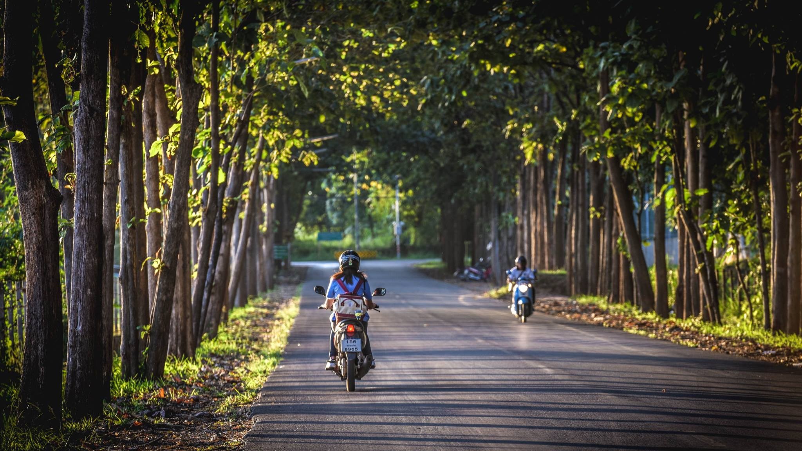

*อ้างอิงภาพจาก:* [boriphat thasi](https://www.facebook.com/kku.archives/photos/p.1580748555392244/1580748555392244/?type=3)

กิจกรรมสานความสัมพันธ์ระหว่างพี่และน้องด้วยการปลูกต้นไม้สายรหัส เป็นการช่วยกันปลูกต้นไม้ยางนา ในพื้นที่ของหมวดประมง ภาควิชาประมง คณะเกษตรศาสตร์ ที่ได้รับการจัดสรรให้ใช้บริเวณพื้นที่รอบๆบึงหนองไผ่ เป็นพื้นที่ในการปลูกต้นไม้ พร้อมนี้ได้มอบหมายให้นักศึกษาชั้นปี1เป็นผู้ดูแลต้นไม้ให้เป็นต้นไม้สายสาย รหัสต่อไป

*อ้างอิงข้อมูลจาก:* [อีเวคนิวส์](https://ewecasia.wordpress.com/2011/07/02/%E0%B9%80%E0%B8%81%E0%B8%A9%E0%B8%95%E0%B8%A3-%E0%B8%A1%E0%B8%82-%E0%B8%9B%E0%B8%A5%E0%B8%B9%E0%B8%81%E0%B8%95%E0%B9%89%E0%B8%99%E0%B9%84%E0%B8%A1%E0%B9%89%E0%B8%AA%E0%B8%B2%E0%B8%A2%E0%B8%A3%E0%B8%AB/)

## Library

หอสมุดกลาง มหาวิทยาลัยขอนแก่น ตั้งอยู่ตรงข้ามกับศูนย์อาหารและบริการ 1 (คอมเพล็กซ์) เปิดบริการให้แก่นักศึกษา บุคคลากร และประชาชนทั่วไป 

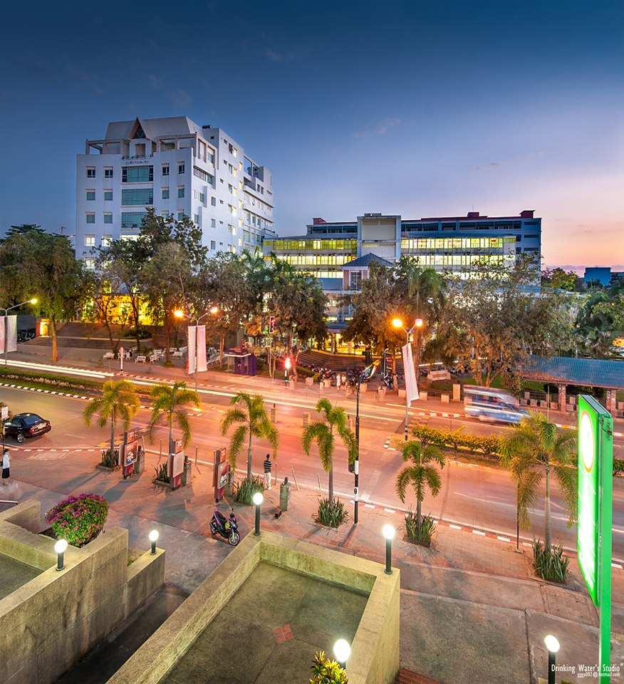

*อ้างอิงภาพจาก:* [LibraryKUUFanpage](https://www.facebook.com/kku.archives/photos/p.1580748555392244/1580748555392244/?type=3)

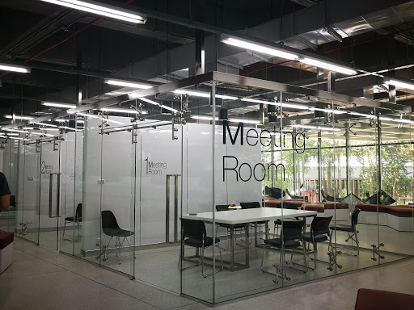

*อ้างอิงภาพจาก:* [LibraryKUUFanpage](https://www.facebook.com/kku.archives/photos/p.1580748555392244/1580748555392244/?type=3)

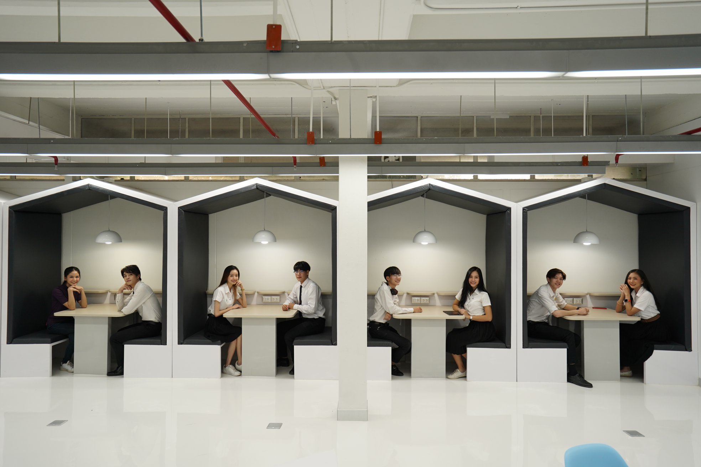

*อ้างอิงภาพจาก:* [LibraryKUUFanpage](https://www.facebook.com/kku.archives/photos/p.1580748555392244/1580748555392244/?type=3)

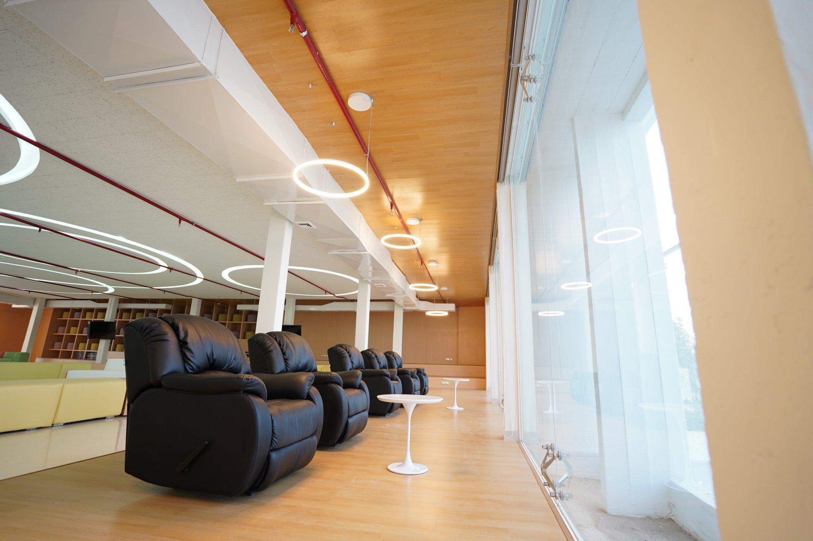

*อ้างอิงภาพจาก:* [LibraryKUUFanpage](https://www.facebook.com/kku.archives/photos/p.1580748555392244/1580748555392244/?type=3)

